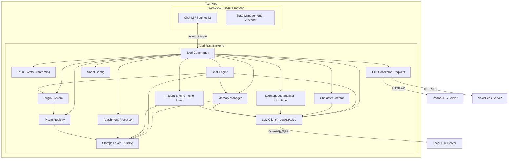

# Design Document: AI Character Chat

## Overview

ローカルLLMを活用したAIキャラクターチャットデスクトップアプリケーションの設計。Tauri v2 + Rustバックエンド + React フロントエンドで構築し、OpenAI互換APIを通じてローカルLLMと通信する。キャラクター作成、チャット、自発的発話、独自思考、記憶管理、TTS連携の各機能をRustモジュールとして実装し、高速性・安定性・低メモリ消費を実現する。

### 設計方針

- **デスクトップファースト**: Tauri v2によるクロスプラットフォーム対応（Windows/macOS/Linux）
- **低リソース消費**: Rustネイティブバックエンドによるメモリ消費30-50MB（Electron比1/4以下）
- **高速・安定**: Rustの型安全性、GCなし、tokioによる非同期処理で安定した動作
- **ローカル完結**: LLM・TTSともにローカルAPIを前提とし、外部クラウドサービスへの依存なし
- **モジュール分離**: 各機能を独立Rustモジュールとして実装し、疎結合を維持
- **オープンソース安全性**: 機密情報をコードから完全分離

## Architecture

### システム構成図



### プロセス構成

| プロセス | 責務 |
|---------|------|
| Tauri Rust Backend | ビジネスロジック、API通信、データ永続化、バックグラウンドタスク（tokio非同期ランタイム） |
| WebView (React) | UI描画、ユーザーインタラクション、状態管理 |

### データフロー

1. ユーザー入力 → WebView → invoke → Chat Engine → LLM Client → LLM API
2. LLM応答 → Chat Engine → Storage保存 → Event emit → WebView表示
3. TTS: Chat Engine → TTS Connector → TTS API → 音声データ → Event → WebView再生
4. 自発的発話: tokio timer → Spontaneous Speaker → LLM → Chat Engine → Event → WebView
5. 記憶圧縮: 閾値到達 → Memory Manager → LLM要約 → Storage保存
6. ファイル添付: WebView → invoke → Attachment Processor → テキスト抽出 → Chat Engine → LLMプロンプトに含める
7. Tool Use: LLM tool_call応答 → Chat Engine → Plugin System → Plugin Handler実行 → 結果をLLMに返却 → 最終応答生成

## Components and Interfaces

### フレームワーク選定: Tauri v2

**選定理由:**
- メモリ消費が極めて低い（30-50MB、Electronの200MB+と比較して1/4以下）
- Rustネイティブ速度によるLLM以外の処理（DB操作、テキスト処理、メモリ管理）の高速化
- Rustの型安全性・所有権システムによる処理の安定性（GCによるパフォーマンス揺らぎなし）
- tokioによる効率的な非同期処理（ストリーミング、タイマー、並行API呼び出し）
- バンドルサイズが小さい（10-20MB、Electron比で1/10以下）
- Tauri v2のEvent Systemによるリアルタイムストリーミングのネイティブサポート
- セキュリティがデフォルトで強固（プロセス分離、allowlist制御）

**Electronを選ばなかった理由:**
- メモリ消費が200MB+と大きく、LLMサーバーと併用時にリソース圧迫
- Chromiumバンドルによるバイナリサイズ肥大化
- GCによるパフォーマンスの不安定さ

### テクノロジースタック

| レイヤー | 技術 | バージョン |
|---------|------|-----------|
| デスクトップフレームワーク | Tauri v2 | ^2.0.0 |
| バックエンド | Rust (tokio, reqwest, rusqlite) | Rust 1.75+ |
| フロントエンド | React + TypeScript | React 19, TS 5.7 |
| ビルドツール | Vite (tauri-plugin-vite) | latest |
| 状態管理 | Zustand | ^5.0.0 |
| UIコンポーネント | Tailwind CSS + shadcn/ui | latest |
| データベース | rusqlite (SQLite) | latest |
| HTTP Client | reqwest (Rust) | latest |
| 非同期ランタイム | tokio | ^1.0 |
| テスト (Frontend) | Vitest + @testing-library/react | latest |
| テスト (Backend) | cargo test + proptest | latest |
| プロパティテスト | fast-check (frontend) + proptest (backend) | latest |
| Tauri Plugin (FS) | tauri-plugin-fs | ^2.0.0 |
| Tauri Plugin (Dialog) | tauri-plugin-dialog | ^2.0.0 |
| PDF抽出 | pdf-extract (Rust) | latest |
| リンター | ESLint + Prettier (frontend), clippy (backend) | latest |
| パッケージマネージャー | pnpm (frontend) + cargo (backend) | pnpm ^9.0.0 |
| ビルド・配布 | tauri-cli (tauri build) | latest |

### モジュール構成

#### LLM Client (`src-tauri/src/llm/client.rs`)

```rust
#[derive(Debug, Clone, Serialize, Deserialize)]
pub struct LLMClientConfig {
    pub base_url: String,
    pub model: String,
    pub api_key: Option<String>,
    pub temperature: f32,
}

#[derive(Debug, Clone, Serialize, Deserialize)]
pub struct ChatMessage {
    pub role: MessageRole,
    pub content: String,
}

#[derive(Debug, Clone, Serialize, Deserialize)]
#[serde(rename_all = "lowercase")]
pub enum MessageRole {
    System,
    User,
    Assistant,
    Tool,
}

#[derive(Debug, Clone, Serialize, Deserialize)]
pub struct ChatMessage {
    pub role: MessageRole,
    pub content: String,
    #[serde(skip_serializing_if = "Option::is_none")]
    pub tool_call_id: Option<String>,       // role=tool時のtool_call参照ID
}

/// LLMレスポンス — テキストまたはtool_call
#[derive(Debug, Clone, Serialize, Deserialize)]
pub enum LLMResponse {
    Text(String),
    ToolCalls(Vec<ToolCall>),
}

#[async_trait]
pub trait LLMClient: Send + Sync {
    async fn chat(&self, messages: &[ChatMessage], config: &LLMClientConfig, tools: Option<&[ToolDefinition]>) -> Result<LLMResponse, AppError>;
    async fn chat_stream(&self, messages: &[ChatMessage], config: &LLMClientConfig) -> Result<impl Stream<Item = Result<String, AppError>>, AppError>;
    async fn test_connection(&self, config: &LLMClientConfig) -> Result<(), AppError>;
}
```

#### TTS Connector (`src-tauri/src/tts/connector.rs`)

```rust
#[derive(Debug, Clone, Serialize, Deserialize)]
#[serde(rename_all = "kebab-case")]
pub enum TTSProvider {
    IrodoriTts,
    Voicepeak,
}

#[derive(Debug, Clone, Serialize, Deserialize)]
pub struct TTSConfig {
    pub provider: TTSProvider,
    pub base_url: String,
    // Irodori-TTS固有
    pub reference_audio_path: Option<String>,
    pub caption: Option<String>,
    // VoicePeak固有
    pub narrator: Option<String>,
    pub emotion: Option<EmotionParams>,
    pub speed: Option<f32>,
    pub pitch: Option<f32>,
}

#[derive(Debug, Clone, Serialize, Deserialize)]
pub struct EmotionParams {
    pub happy: Option<i32>,
    pub fun: Option<i32>,
    pub angry: Option<i32>,
    pub sad: Option<i32>,
}

#[async_trait]
pub trait TTSConnector: Send + Sync {
    async fn synthesize(&self, text: &str, config: &TTSConfig) -> Result<Vec<u8>, AppError>;
    async fn test_connection(&self, config: &TTSConfig) -> Result<(), AppError>;
}
```

#### Character Creator (`src-tauri/src/character/creator.rs`)

```rust
#[async_trait]
pub trait CharacterCreator: Send + Sync {
    async fn generate_system_prompt(&self, name: &str, description: &str) -> Result<String, AppError>;
    async fn save_character(&self, character: &Character) -> Result<String, AppError>; // returns character_id
    async fn update_character(&self, id: &str, updates: CharacterUpdate) -> Result<(), AppError>;
    async fn delete_character(&self, id: &str) -> Result<(), AppError>;
    async fn list_characters(&self) -> Result<Vec<Character>, AppError>;
    async fn get_character(&self, id: &str) -> Result<Option<Character>, AppError>;
}
```

#### Chat Engine (`src-tauri/src/chat/engine.rs`)

```rust
#[async_trait]
pub trait ChatEngine: Send + Sync {
    async fn create_session(&self, character_id: &str) -> Result<String, AppError>; // returns session_id
    async fn send_message(&self, session_id: &str, content: &str, attachments: Option<&[Attachment]>, app_handle: &AppHandle) -> Result<(), AppError>; // streams via events
    async fn get_history(&self, session_id: &str) -> Result<Vec<ChatMessageRecord>, AppError>;
    async fn list_sessions(&self, character_id: &str) -> Result<Vec<ChatSession>, AppError>;
    async fn delete_session(&self, session_id: &str) -> Result<(), AppError>;
}
```

#### Spontaneous Speaker (`src-tauri/src/spontaneous/speaker.rs`)

```rust
#[derive(Debug, Clone, Serialize, Deserialize)]
pub struct SpontaneousSpeakerConfig {
    pub enabled: bool,
    pub min_interval_seconds: u64,
}

pub trait SpontaneousSpeaker: Send + Sync {
    fn start(&self, session_id: &str, config: SpontaneousSpeakerConfig, app_handle: AppHandle);
    fn stop(&self);
    fn update_config(&self, config: SpontaneousSpeakerConfig);
}
```

#### Thought Engine (`src-tauri/src/thought/engine.rs`)

```rust
#[async_trait]
pub trait ThoughtEngine: Send + Sync {
    async fn generate_thought(&self, character_id: &str) -> Result<Thought, AppError>;
    async fn get_thoughts(&self, character_id: &str, limit: Option<u32>) -> Result<Vec<Thought>, AppError>;
    fn set_frequency(&self, character_id: &str, interval_minutes: u64);
    fn start(&self, character_id: &str, app_handle: AppHandle);
    fn stop(&self);
}
```

#### Memory Manager (`src-tauri/src/memory/manager.rs`)

```rust
#[async_trait]
pub trait MemoryManager: Send + Sync {
    async fn check_and_compress(&self, session_id: &str) -> Result<(), AppError>;
    async fn get_relevant_memories(&self, character_id: &str, context: &str) -> Result<Vec<Memory>, AppError>;
    async fn list_memories(&self, character_id: &str) -> Result<Vec<Memory>, AppError>;
    async fn update_memory(&self, id: &str, content: &str) -> Result<(), AppError>;
    async fn delete_memory(&self, id: &str) -> Result<(), AppError>;
}
```

#### Attachment Processor (`src-tauri/src/attachment/processor.rs`)

```rust
#[derive(Debug, Clone, Serialize, Deserialize)]
pub enum AttachmentType {
    Text,   // .txt, .md, .csv
    Pdf,    // .pdf
    Image,  // .png, .jpg, .webp
}

#[derive(Debug, Clone, Serialize, Deserialize)]
pub struct Attachment {
    pub id: String,
    pub file_name: String,
    pub file_path: String,
    pub attachment_type: AttachmentType,
    pub size_bytes: u64,
    pub extracted_text: Option<String>,    // テキスト/PDF抽出結果
    pub base64_data: Option<String>,       // 画像のBase64エンコード
}

pub const MAX_FILE_SIZE: u64 = 10 * 1024 * 1024; // 10MB

#[async_trait]
pub trait AttachmentProcessor: Send + Sync {
    async fn process_file(&self, file_path: &str) -> Result<Attachment, AppError>;
    fn supported_extensions(&self) -> Vec<&'static str>;
    fn is_supported(&self, file_path: &str) -> bool;
    async fn extract_text(&self, attachment: &Attachment) -> Result<String, AppError>;
    async fn encode_image(&self, attachment: &Attachment) -> Result<String, AppError>;
}
```

#### Plugin System (`src-tauri/src/plugin/system.rs`)

```rust
use serde_json::Value;

/// OpenAI Function Calling互換のツール定義
#[derive(Debug, Clone, Serialize, Deserialize)]
pub struct ToolDefinition {
    pub name: String,
    pub description: String,
    pub parameters: Value, // JSON Schema
}

/// LLMからのtool_callリクエスト
#[derive(Debug, Clone, Serialize, Deserialize)]
pub struct ToolCall {
    pub id: String,
    pub name: String,
    pub arguments: Value,
}

/// ツール実行結果
#[derive(Debug, Clone, Serialize, Deserialize)]
pub struct ToolResult {
    pub tool_call_id: String,
    pub content: String,
    pub is_error: bool,
}

/// プラグインハンドラtrait — 第三者が実装可能
#[async_trait]
pub trait PluginHandler: Send + Sync {
    fn name(&self) -> &str;
    fn description(&self) -> &str;
    fn tools(&self) -> Vec<ToolDefinition>;
    async fn execute(&self, tool_call: &ToolCall) -> Result<ToolResult, AppError>;
}

/// プラグインメタデータ
#[derive(Debug, Clone, Serialize, Deserialize)]
pub struct PluginInfo {
    pub name: String,
    pub description: String,
    pub version: String,
    pub enabled: bool,
    pub tools: Vec<ToolDefinition>,
    pub config: Option<Value>, // プラグイン固有設定
}

#[async_trait]
pub trait PluginSystem: Send + Sync {
    async fn handle_tool_calls(&self, tool_calls: &[ToolCall]) -> Result<Vec<ToolResult>, AppError>;
    fn get_enabled_tools(&self) -> Vec<ToolDefinition>;
}
```

#### Plugin Registry (`src-tauri/src/plugin/registry.rs`)

```rust
#[async_trait]
pub trait PluginRegistry: Send + Sync {
    fn register(&self, handler: Box<dyn PluginHandler>) -> Result<(), AppError>;
    fn unregister(&self, name: &str) -> Result<(), AppError>;
    fn list_plugins(&self) -> Vec<PluginInfo>;
    fn enable_plugin(&self, name: &str) -> Result<(), AppError>;
    fn disable_plugin(&self, name: &str) -> Result<(), AppError>;
    fn get_plugin(&self, name: &str) -> Option<&dyn PluginHandler>;
    async fn update_plugin_config(&self, name: &str, config: Value) -> Result<(), AppError>;
}
```

### IPC通信設計

Tauri v2のCommand（invoke）とEvent（emit/listen）を使用し、フロントエンド-バックエンド間通信を実現:

#### Tauri Commands（同期的リクエスト/レスポンス）

```rust
// src-tauri/src/commands/character.rs
#[tauri::command]
async fn create_character(name: String, description: String, state: State<'_, AppState>) -> Result<Character, AppError> { ... }

#[tauri::command]
async fn list_characters(state: State<'_, AppState>) -> Result<Vec<Character>, AppError> { ... }

#[tauri::command]
async fn get_character(id: String, state: State<'_, AppState>) -> Result<Option<Character>, AppError> { ... }

#[tauri::command]
async fn update_character(id: String, updates: CharacterUpdate, state: State<'_, AppState>) -> Result<(), AppError> { ... }

#[tauri::command]
async fn delete_character(id: String, state: State<'_, AppState>) -> Result<(), AppError> { ... }

// src-tauri/src/commands/chat.rs
#[tauri::command]
async fn create_session(character_id: String, state: State<'_, AppState>) -> Result<String, AppError> { ... }

#[tauri::command]
async fn send_message(session_id: String, content: String, attachments: Option<Vec<String>>, app_handle: AppHandle, state: State<'_, AppState>) -> Result<(), AppError> { ... }

#[tauri::command]
async fn get_history(session_id: String, state: State<'_, AppState>) -> Result<Vec<ChatMessageRecord>, AppError> { ... }

#[tauri::command]
async fn list_sessions(character_id: String, state: State<'_, AppState>) -> Result<Vec<ChatSession>, AppError> { ... }

#[tauri::command]
async fn delete_session(session_id: String, state: State<'_, AppState>) -> Result<(), AppError> { ... }

// src-tauri/src/commands/config.rs
#[tauri::command]
async fn get_config(state: State<'_, AppState>) -> Result<AppConfig, AppError> { ... }

#[tauri::command]
async fn set_config(config: AppConfig, state: State<'_, AppState>) -> Result<(), AppError> { ... }

#[tauri::command]
async fn test_llm_connection(settings: ModelSettings, state: State<'_, AppState>) -> Result<(), AppError> { ... }

// src-tauri/src/commands/attachment.rs
#[tauri::command]
async fn process_attachment(file_path: String, state: State<'_, AppState>) -> Result<Attachment, AppError> { ... }

#[tauri::command]
async fn get_supported_extensions(state: State<'_, AppState>) -> Result<Vec<String>, AppError> { ... }

// src-tauri/src/commands/plugin.rs
#[tauri::command]
async fn list_plugins(state: State<'_, AppState>) -> Result<Vec<PluginInfo>, AppError> { ... }

#[tauri::command]
async fn enable_plugin(name: String, state: State<'_, AppState>) -> Result<(), AppError> { ... }

#[tauri::command]
async fn disable_plugin(name: String, state: State<'_, AppState>) -> Result<(), AppError> { ... }

#[tauri::command]
async fn get_plugin_config(name: String, state: State<'_, AppState>) -> Result<Option<serde_json::Value>, AppError> { ... }

#[tauri::command]
async fn set_plugin_config(name: String, config: serde_json::Value, state: State<'_, AppState>) -> Result<(), AppError> { ... }
```

#### Tauri Events（リアルタイムストリーミング）

```rust
// ストリーミングレスポンス用イベント
#[derive(Clone, Serialize)]
struct ChatStreamEvent {
    session_id: String,
    chunk: String,
    done: bool,
}

// バックエンドからフロントエンドへのイベント発火
app_handle.emit("chat:stream", ChatStreamEvent { session_id, chunk, done: false })?;
app_handle.emit("chat:stream", ChatStreamEvent { session_id, chunk: String::new(), done: true })?;

// 自発的発話イベント
app_handle.emit("spontaneous:message", SpontaneousEvent { session_id, message })?;

// 思考生成イベント
app_handle.emit("thought:generated", ThoughtEvent { character_id, thought })?;

// TTS音声データイベント
app_handle.emit("tts:audio", TTSAudioEvent { data: base64_audio })?;

// ツール実行イベント
app_handle.emit("tool:executing", ToolExecutingEvent { session_id, tool_name })?;
app_handle.emit("tool:result", ToolResultEvent { session_id, tool_call_id, content, is_error })?;
```

#### フロントエンド側（TypeScript）

```typescript
// invoke でコマンド呼び出し
import { invoke } from '@tauri-apps/api/core';
const characters = await invoke<Character[]>('list_characters');

// listen でイベント受信
import { listen } from '@tauri-apps/api/event';
const unlisten = await listen<ChatStreamEvent>('chat:stream', (event) => {
  if (event.payload.done) {
    // ストリーミング完了
  } else {
    appendChunk(event.payload.chunk);
  }
});
```

## Data Models

### Rust Backend Structs

```rust
// src-tauri/src/models/character.rs
#[derive(Debug, Clone, Serialize, Deserialize)]
pub struct Character {
    pub id: String,              // UUID v4
    pub name: String,
    pub description: String,     // ユーザーが入力した概要説明
    pub system_prompt: String,   // LLM生成 or 手動編集されたシステムプロンプト
    pub avatar_path: Option<String>,
    pub tts_config: Option<TTSConfig>,
    pub created_at: String,      // ISO 8601
    pub updated_at: String,      // ISO 8601
}

#[derive(Debug, Clone, Serialize, Deserialize)]
pub struct CharacterUpdate {
    pub name: Option<String>,
    pub description: Option<String>,
    pub system_prompt: Option<String>,
    pub avatar_path: Option<String>,
    pub tts_config: Option<TTSConfig>,
}
```

```rust
// src-tauri/src/models/chat.rs
#[derive(Debug, Clone, Serialize, Deserialize)]
pub struct ChatSession {
    pub id: String,              // UUID v4
    pub character_id: String,
    pub title: Option<String>,
    pub last_message_at: Option<String>,
    pub last_message_preview: Option<String>,
    pub created_at: String,
}

#[derive(Debug, Clone, Serialize, Deserialize)]
pub struct ChatMessageRecord {
    pub id: String,
    pub session_id: String,
    pub role: ChatRole,
    pub content: String,
    pub attachments: Option<Vec<MessageAttachment>>,  // 添付ファイル情報
    pub tool_calls: Option<Vec<ToolCall>>,            // tool_callリクエスト（role=assistant時）
    pub tool_call_id: Option<String>,                 // tool結果（role=tool時）
    pub created_at: String,
}

#[derive(Debug, Clone, Serialize, Deserialize)]
pub struct MessageAttachment {
    pub file_name: String,
    pub attachment_type: String,  // "text", "pdf", "image"
    pub extracted_text: Option<String>,
    pub base64_data: Option<String>,
}

#[derive(Debug, Clone, Serialize, Deserialize)]
#[serde(rename_all = "lowercase")]
pub enum ChatRole {
    User,
    Assistant,
    Spontaneous,
    Tool,
}
```

```rust
// src-tauri/src/models/memory.rs
#[derive(Debug, Clone, Serialize, Deserialize)]
pub struct Memory {
    pub id: String,
    pub character_id: String,
    pub content: String,           // LLMによる要約テキスト
    pub source_session_id: Option<String>,
    pub source_message_from: Option<String>,
    pub source_message_to: Option<String>,
    pub created_at: String,
    pub updated_at: String,
}
```

```rust
// src-tauri/src/models/thought.rs
#[derive(Debug, Clone, Serialize, Deserialize)]
pub struct Thought {
    pub id: String,
    pub character_id: String,
    pub content: String,
    pub context: Option<String>,   // 思考生成時の参照コンテキスト概要
    pub created_at: String,
}
```

```rust
// src-tauri/src/models/config.rs
#[derive(Debug, Clone, Serialize, Deserialize)]
#[serde(rename_all = "snake_case")]
pub enum ModelPurpose {
    Chat,
    Memory,
    Thought,
    CharacterGeneration,
}

#[derive(Debug, Clone, Serialize, Deserialize)]
pub struct ModelSettings {
    pub base_url: String,
    pub model: String,
    pub api_key: Option<String>,
    pub temperature: f32,
}

#[derive(Debug, Clone, Serialize, Deserialize)]
pub struct AppConfig {
    pub models: HashMap<ModelPurpose, ModelSettings>,
    pub spontaneous: SpontaneousConfig,
    pub thought: ThoughtConfig,
    pub memory: MemoryConfig,
    pub tts: TTSGlobalConfig,
    pub ui: UIConfig,
    pub plugins: PluginsConfig,
    pub attachment: AttachmentConfig,
}

#[derive(Debug, Clone, Serialize, Deserialize)]
pub struct PluginsConfig {
    pub enabled_plugins: Vec<String>,
    pub plugin_settings: HashMap<String, serde_json::Value>, // プラグイン名 → 固有設定
}

#[derive(Debug, Clone, Serialize, Deserialize)]
pub struct AttachmentConfig {
    pub max_file_size_bytes: u64,       // デフォルト10MB
    pub allowed_extensions: Vec<String>,
}

#[derive(Debug, Clone, Serialize, Deserialize)]
pub struct SpontaneousConfig {
    pub enabled: bool,
    pub min_interval_seconds: u64,
}

#[derive(Debug, Clone, Serialize, Deserialize)]
pub struct ThoughtConfig {
    pub enabled: bool,
    pub interval_minutes: u64,
}

#[derive(Debug, Clone, Serialize, Deserialize)]
pub struct MemoryConfig {
    pub compression_threshold: u32, // メッセージ数
}

#[derive(Debug, Clone, Serialize, Deserialize)]
pub struct TTSGlobalConfig {
    pub enabled: bool,
}

#[derive(Debug, Clone, Serialize, Deserialize)]
pub struct UIConfig {
    pub theme: Theme,
    pub language: String,
}

#[derive(Debug, Clone, Serialize, Deserialize)]
#[serde(rename_all = "lowercase")]
pub enum Theme {
    Light,
    Dark,
}
```

### Frontend TypeScript Types

フロントエンドではRust側のstructと同等の型定義を使用（Tauri invokeの型安全性確保）:

```typescript
// src/types/character.ts
interface Character {
  id: string;
  name: string;
  description: string;
  system_prompt: string;
  avatar_path?: string;
  tts_config?: TTSConfig;
  created_at: string;
  updated_at: string;
}

// src/types/chat.ts
interface ChatSession {
  id: string;
  character_id: string;
  title?: string;
  last_message_at?: string;
  last_message_preview?: string;
  created_at: string;
}

interface ChatMessageRecord {
  id: string;
  session_id: string;
  role: 'user' | 'assistant' | 'spontaneous' | 'tool';
  content: string;
  attachments?: MessageAttachment[];
  tool_calls?: ToolCall[];
  tool_call_id?: string;
  created_at: string;
}

interface MessageAttachment {
  file_name: string;
  attachment_type: 'text' | 'pdf' | 'image';
  extracted_text?: string;
  base64_data?: string;
}

interface ToolCall {
  id: string;
  name: string;
  arguments: Record<string, unknown>;
}

interface PluginInfo {
  name: string;
  description: string;
  version: string;
  enabled: boolean;
  tools: ToolDefinition[];
  config?: Record<string, unknown>;
}

interface ToolDefinition {
  name: string;
  description: string;
  parameters: Record<string, unknown>; // JSON Schema
}

// src/types/config.ts
interface AppConfig {
  models: Record<ModelPurpose, ModelSettings>;
  spontaneous: { enabled: boolean; min_interval_seconds: number };
  thought: { enabled: boolean; interval_minutes: number };
  memory: { compression_threshold: number };
  tts: { enabled: boolean };
  ui: { theme: 'light' | 'dark'; language: string };
  plugins: { enabled_plugins: string[]; plugin_settings: Record<string, unknown> };
  attachment: { max_file_size_bytes: number; allowed_extensions: string[] };
}
```

### SQLiteスキーマ

```sql
CREATE TABLE characters (
  id TEXT PRIMARY KEY,
  name TEXT NOT NULL,
  description TEXT NOT NULL,
  system_prompt TEXT NOT NULL,
  avatar_path TEXT,
  tts_config TEXT, -- JSON
  created_at TEXT NOT NULL,
  updated_at TEXT NOT NULL
);

CREATE TABLE chat_sessions (
  id TEXT PRIMARY KEY,
  character_id TEXT NOT NULL REFERENCES characters(id) ON DELETE CASCADE,
  title TEXT,
  last_message_at TEXT,
  last_message_preview TEXT,
  created_at TEXT NOT NULL
);

CREATE TABLE chat_messages (
  id TEXT PRIMARY KEY,
  session_id TEXT NOT NULL REFERENCES chat_sessions(id) ON DELETE CASCADE,
  role TEXT NOT NULL CHECK(role IN ('user', 'assistant', 'spontaneous', 'tool')),
  content TEXT NOT NULL,
  attachments TEXT,       -- JSON array of MessageAttachment
  tool_calls TEXT,        -- JSON array of ToolCall (role=assistant時)
  tool_call_id TEXT,      -- tool結果のtool_call参照ID (role=tool時)
  created_at TEXT NOT NULL
);

CREATE TABLE memories (
  id TEXT PRIMARY KEY,
  character_id TEXT NOT NULL REFERENCES characters(id) ON DELETE CASCADE,
  content TEXT NOT NULL,
  source_session_id TEXT REFERENCES chat_sessions(id),
  source_message_from TEXT,
  source_message_to TEXT,
  created_at TEXT NOT NULL,
  updated_at TEXT NOT NULL
);

CREATE TABLE thoughts (
  id TEXT PRIMARY KEY,
  character_id TEXT NOT NULL REFERENCES characters(id) ON DELETE CASCADE,
  content TEXT NOT NULL,
  context TEXT,
  created_at TEXT NOT NULL
);

CREATE INDEX idx_chat_sessions_character ON chat_sessions(character_id);
CREATE INDEX idx_chat_messages_session ON chat_messages(session_id);
CREATE INDEX idx_memories_character ON memories(character_id);
CREATE INDEX idx_thoughts_character ON thoughts(character_id);

CREATE TABLE plugins (
  name TEXT PRIMARY KEY,
  description TEXT NOT NULL,
  version TEXT NOT NULL,
  enabled INTEGER NOT NULL DEFAULT 1,
  config TEXT,            -- JSON: プラグイン固有設定
  created_at TEXT NOT NULL,
  updated_at TEXT NOT NULL
);

CREATE TABLE attachments (
  id TEXT PRIMARY KEY,
  message_id TEXT NOT NULL REFERENCES chat_messages(id) ON DELETE CASCADE,
  file_name TEXT NOT NULL,
  attachment_type TEXT NOT NULL CHECK(attachment_type IN ('text', 'pdf', 'image')),
  file_path TEXT NOT NULL,
  size_bytes INTEGER NOT NULL,
  extracted_text TEXT,
  created_at TEXT NOT NULL
);

CREATE INDEX idx_attachments_message ON attachments(message_id);
```


## Correctness Properties

*A property is a characteristic or behavior that should hold true across all valid executions of a system—essentially, a formal statement about what the system should do. Properties serve as the bridge between human-readable specifications and machine-verifiable correctness guarantees.*

**実装注記:** バックエンドのプロパティテストはRustの`proptest`クレートで実装。フロントエンドの状態管理に関するプロパティは`fast-check`で実装。

### Property 1: Character serialization round-trip

*For any* valid Character object (including name, description, systemPrompt, ttsConfig, and all metadata fields), serializing to JSON and deserializing back SHALL produce an equivalent Character object.

**Validates: Requirements 1.2, 6.3**

### Property 2: Character listing completeness

*For any* set of created Characters, calling listCharacters SHALL return exactly those characters — no more, no fewer.

**Validates: Requirements 1.4**

### Property 3: Cascade delete removes all related data

*For any* Character with associated ChatSessions, ChatMessages, Memories, and Thoughts, deleting that Character SHALL result in zero remaining records referencing that Character's ID across all tables.

**Validates: Requirements 1.6**

### Property 4: Chat context assembly includes system prompt, history, and memories

*For any* chat message sent in a session belonging to a Character with existing Memories, the LLM request SHALL contain the Character's systemPrompt as the first message, all relevant Memories in the prompt, and the full chat history in chronological order.

**Validates: Requirements 2.2, 5.3**

### Property 5: Session listing completeness

*For any* Character with created ChatSessions, calling listSessions SHALL return all sessions belonging to that Character.

**Validates: Requirements 2.3**

### Property 6: Session metadata invariant

*For any* ChatSession with one or more messages, the session's lastMessageAt SHALL equal the createdAt of the most recent message, and lastMessagePreview SHALL equal a prefix of that message's content.

**Validates: Requirements 2.4**

### Property 7: Spontaneous speech interval enforcement

*For any* SpontaneousSpeakerConfig with minIntervalSeconds = N, the time between consecutive spontaneous speech evaluations SHALL be >= N seconds.

**Validates: Requirements 3.1**

### Property 8: Spontaneous speech context assembly

*For any* active ChatSession, when spontaneous speech is triggered, the LLM request SHALL include the Character's systemPrompt and the most recent messages from the session as context.

**Validates: Requirements 3.2**

### Property 9: Spontaneous messages have distinct role

*For any* message generated by the Spontaneous Speaker, it SHALL be stored with role='spontaneous', distinct from regular assistant responses (role='assistant') and user messages (role='user').

**Validates: Requirements 3.5**

### Property 10: Thought storage separation

*For any* generated Thought, it SHALL exist only in the thoughts storage and SHALL NOT appear in any chat_messages query result.

**Validates: Requirements 4.2**

### Property 11: Thought generation context includes chat and memories

*For any* thought generation request for a Character with existing ChatSessions and Memories, the LLM request SHALL include both recent chat messages and relevant Memory content as context.

**Validates: Requirements 4.4**

### Property 12: Memory compression threshold trigger

*For any* ChatSession where the uncompressed message count reaches the configured compressionThreshold, the Memory Manager SHALL create a new Memory record summarizing those messages. For sessions below the threshold, no compression SHALL occur.

**Validates: Requirements 5.1**

### Property 13: Memory metadata correctness

*For any* created or updated Memory, the record SHALL contain a valid updatedAt timestamp and a sourceSessionId referencing the originating ChatSession.

**Validates: Requirements 5.5**

### Property 14: TTS request format correctness per provider

*For any* text and TTSConfig specifying a provider (irodori-tts or voicepeak), the constructed HTTP request SHALL conform to that provider's API format, including all configured parameters (caption/emotion for Irodori-TTS; narrator/emotion/speed/pitch for VoicePeak).

**Validates: Requirements 6.2, 6.4**

### Property 15: Model config per-purpose isolation

*For any* set of ModelSettings configured for different purposes (chat, memory, thought, character_generation), updating the config for one purpose SHALL NOT affect the configs of other purposes.

**Validates: Requirements 7.1**

### Property 16: Model config round-trip

*For any* valid ModelSettings (baseUrl, model, apiKey, temperature), saving to the config store and loading back SHALL produce an equivalent ModelSettings object.

**Validates: Requirements 7.2**

### Property 17: LLM request OpenAI format compliance

*For any* array of ChatMessages, the LLM Client SHALL construct a request body containing a `model` field and a `messages` array where each element has `role` (string) and `content` (string) fields, conforming to the OpenAI Chat Completion API schema.

**Validates: Requirements 7.3**

### Property 18: Attachment file size validation

*For any* file path provided to the Attachment Processor, if the file size exceeds MAX_FILE_SIZE (10MB), the processor SHALL return an error. For files within the size limit, processing SHALL succeed (given a supported extension).

**Validates: Requirements 10.5**

### Property 19: Attachment type detection correctness

*For any* file with a supported extension (.txt, .md, .csv, .pdf, .png, .jpg, .webp), the Attachment Processor SHALL correctly classify the AttachmentType. For unsupported extensions, the processor SHALL return an error listing supported formats.

**Validates: Requirements 10.2, 10.6**

### Property 20: Attachment round-trip persistence

*For any* valid Attachment associated with a ChatMessageRecord, saving to the database and loading back SHALL produce an equivalent Attachment object with identical file_name, attachment_type, and extracted_text/base64_data.

**Validates: Requirements 10.8**

### Property 21: Plugin registration idempotence

*For any* PluginHandler registered in the Plugin Registry, registering the same plugin (by name) again SHALL NOT create a duplicate entry. The registry SHALL contain exactly one entry per unique plugin name.

**Validates: Requirements 11.2**

### Property 22: Plugin enable/disable isolation

*For any* set of registered Plugins, enabling or disabling one Plugin SHALL NOT affect the enabled state of other Plugins.

**Validates: Requirements 11.2**

### Property 23: Tool definition format compliance

*For any* PluginHandler's tools() output, each ToolDefinition SHALL contain a non-empty name, a non-empty description, and a valid JSON Schema object in the parameters field, conforming to the OpenAI Function Calling schema.

**Validates: Requirements 11.1**

### Property 24: Tool call dispatch correctness

*For any* ToolCall with a name matching a registered and enabled Plugin's tool, the Plugin System SHALL dispatch the call to the correct PluginHandler. For tool names not matching any enabled plugin, the system SHALL return an error ToolResult.

**Validates: Requirements 11.3, 11.7**

### Property 25: Tool result propagation to LLM

*For any* ToolResult returned by a PluginHandler, the Chat Engine SHALL include it as a message with role=tool and the corresponding tool_call_id in the subsequent LLM request, enabling the LLM to generate a final response incorporating the tool result.

**Validates: Requirements 11.3, 11.9**

### Property 26: Plugin config persistence round-trip

*For any* valid plugin configuration (JSON Value), saving via update_plugin_config and loading back SHALL produce an equivalent configuration object.

**Validates: Requirements 11.8**

## Error Handling

### エラーハンドリング戦略

| エラー種別 | 対応方針 | ユーザーへの表示 |
|-----------|---------|----------------|
| LLM API接続失敗 | リトライ不可、エラー表示 + 再送信ボタン | 「接続エラー: [詳細]。再送信してください」 |
| LLM APIタイムアウト | 30秒タイムアウト、自動キャンセル | 「応答がタイムアウト。再送信してください」 |
| TTS API失敗 | テキストのみで会話継続 | 「音声生成に失敗。テキストで表示」 |
| ストリーミング中断 | 受信済みテキストを保持、再送信可能 | 部分テキスト表示 + 「中断されました」 |
| DB書き込み失敗 | ロールバック、エラー通知 | 「保存に失敗。再試行してください」 |
| 設定ファイル破損 | デフォルト値にフォールバック | 「設定を初期化。再設定してください」 |
| キャラクター生成失敗 | LLMエラーを表示、手動入力を促す | 「自動生成に失敗。手動で入力してください」 |
| 添付ファイルサイズ超過 | 添付拒否、上限表示 | 「ファイルサイズが上限(10MB)を超過」 |
| 非対応ファイル形式 | 添付拒否、対応形式一覧表示 | 「非対応形式。対応: txt, md, csv, pdf, png, jpg, webp」 |
| ファイル読み込み失敗 | エラー表示、再選択を促す | 「ファイルの読み込みに失敗。再選択してください」 |
| プラグイン実行失敗 | エラーをLLMに返却、キャラクターが説明 | ツール実行エラーをキャラクターが自然言語で説明 |
| プラグイン未登録 | エラーをLLMに返却 | 「指定されたツールが見つからない」 |

### エラー型定義

```rust
// src-tauri/src/error.rs
use serde::Serialize;
use thiserror::Error;

#[derive(Debug, Error, Serialize, Clone)]
#[serde(tag = "code", content = "details")]
pub enum AppError {
    #[error("LLM接続失敗: {0}")]
    LlmConnectionFailed(String),
    #[error("LLMタイムアウト")]
    LlmTimeout,
    #[error("LLM不正レスポンス: {0}")]
    LlmInvalidResponse(String),
    #[error("TTS接続失敗: {0}")]
    TtsConnectionFailed(String),
    #[error("TTS不正レスポンス: {0}")]
    TtsInvalidResponse(String),
    #[error("DB書き込み失敗: {0}")]
    DbWriteFailed(String),
    #[error("DB読み取り失敗: {0}")]
    DbReadFailed(String),
    #[error("設定ファイル破損: {0}")]
    ConfigCorrupted(String),
    #[error("キャラクター生成失敗: {0}")]
    CharacterGenerationFailed(String),
    #[error("入力値不正: {0}")]
    InvalidInput(String),
    #[error("添付ファイルサイズ超過: {0}")]
    AttachmentTooLarge(String),
    #[error("非対応ファイル形式: {0}")]
    UnsupportedFileType(String),
    #[error("ファイル読み込み失敗: {0}")]
    FileReadFailed(String),
    #[error("プラグイン実行失敗: {0}")]
    PluginExecutionFailed(String),
    #[error("プラグイン未登録: {0}")]
    PluginNotFound(String),
}

impl AppError {
    pub fn is_recoverable(&self) -> bool {
        matches!(self,
            AppError::LlmConnectionFailed(_) |
            AppError::LlmTimeout |
            AppError::TtsConnectionFailed(_) |
            AppError::CharacterGenerationFailed(_)
        )
    }
}

// Tauri command用のSerialize実装
impl From<AppError> for tauri::ipc::InvokeError {
    fn from(error: AppError) -> Self {
        tauri::ipc::InvokeError::from(serde_json::to_string(&error).unwrap())
    }
}
```

### リトライポリシー

- LLM API: リトライなし（ユーザーが再送信ボタンで明示的に再試行）
- TTS API: 1回自動リトライ（1秒待機後）、失敗時はテキストのみ継続
- DB操作: リトライなし（即座にエラー通知）

## Testing Strategy

### テストフレームワーク

- **バックエンドユニットテスト**: cargo test
- **バックエンドプロパティテスト**: proptest（Rust）
- **フロントエンドユニットテスト**: Vitest
- **フロントエンドプロパティテスト**: fast-check（Vitest上で実行）
- **コンポーネントテスト**: @testing-library/react + Vitest
- **E2Eテスト**: tauri-driver (WebDriver)

### テスト構成

```
ai-character-chat/
├── src-tauri/
│   └── src/
│       ├── llm/
│       │   └── tests.rs          # cargo test (unit + proptest)
│       ├── tts/
│       │   └── tests.rs
│       ├── character/
│       │   └── tests.rs
│       ├── chat/
│       │   └── tests.rs
│       ├── spontaneous/
│       │   └── tests.rs
│       ├── thought/
│       │   └── tests.rs
│       ├── memory/
│       │   └── tests.rs
│       └── config/
│           └── tests.rs
├── tests/                         # Frontend tests
│   ├── unit/
│   │   ├── stores/
│   │   └── hooks/
│   ├── property/                  # fast-check プロパティテスト
│   │   ├── character.property.test.ts
│   │   ├── chat.property.test.ts
│   │   ├── memory.property.test.ts
│   │   ├── tts.property.test.ts
│   │   ├── config.property.test.ts
│   │   ├── spontaneous.property.test.ts
│   │   ├── attachment.property.test.ts
│   │   └── plugin.property.test.ts
│   ├── component/
│   │   ├── ChatView.test.tsx
│   │   ├── Sidebar.test.tsx
│   │   └── Settings.test.tsx
│   └── e2e/
│       ├── chat-flow.spec.ts
│       └── character-creation.spec.ts
```

### プロパティベーステスト設定

**Rustバックエンド（proptest）:**
- ライブラリ: `proptest` crate
- 各プロパティテスト: 最低100イテレーション（`proptest! { #![proptest_config(ProptestConfig::with_cases(100))]`）
- タグフォーマット: コメントで `// Feature: ai-character-chat, Property {number}: {property_text}`
- バックエンドのビジネスロジック（シリアライゼーション、コンテキスト組み立て、メモリ圧縮判定等）をカバー

**フロントエンド（fast-check）:**
- ライブラリ: `fast-check`（TypeScript対応、Vitest統合）
- 各プロパティテスト: 最低100イテレーション
- タグフォーマット: `Feature: ai-character-chat, Property {number}: {property_text}`
- フロントエンドの状態管理ロジック、データ変換をカバー

### ユニットテスト方針

**Rustバックエンド:**
- LLM/TTS APIはmockall crateでモック
- SQLiteはインメモリDB（`:memory:`）でテスト
- 各モジュールのpubインターフェースに対してテスト
- エッジケース（空文字列、超長文、特殊文字）をカバー

**Reactフロントエンド:**
- Tauri invoke/listenはモックで代替
- Zustand storeの状態遷移テスト
- コンポーネントのレンダリング・インタラクションテスト

### CI統合

- GitHub Actionsで全テスト実行
- バックエンド: `cargo test` + `cargo clippy` + `cargo fmt --check`
- フロントエンド: `pnpm test` + `pnpm lint` + `pnpm type-check`
- プロパティテストはCI上でも100イテレーション実行
- ビルド検証: `cargo tauri build --debug`

## ディレクトリ構成

```
ai-character-chat/
├── .github/
│   └── workflows/
│       └── ci.yml
├── src-tauri/                     # Rust Backend
│   ├── src/
│   │   ├── main.rs               # Tauriエントリーポイント
│   │   ├── lib.rs                # モジュール宣言
│   │   ├── error.rs              # AppError定義
│   │   ├── state.rs              # AppState（共有状態）
│   │   ├── commands/             # Tauri Commands
│   │   │   ├── mod.rs
│   │   │   ├── character.rs
│   │   │   ├── chat.rs
│   │   │   ├── config.rs
│   │   │   ├── memory.rs
│   │   │   ├── thought.rs
│   │   │   ├── tts.rs
│   │   │   ├── attachment.rs
│   │   │   └── plugin.rs
│   │   ├── llm/
│   │   │   ├── mod.rs
│   │   │   ├── client.rs
│   │   │   └── tests.rs
│   │   ├── tts/
│   │   │   ├── mod.rs
│   │   │   ├── connector.rs
│   │   │   ├── irodori.rs
│   │   │   ├── voicepeak.rs
│   │   │   └── tests.rs
│   │   ├── character/
│   │   │   ├── mod.rs
│   │   │   ├── creator.rs
│   │   │   └── tests.rs
│   │   ├── chat/
│   │   │   ├── mod.rs
│   │   │   ├── engine.rs
│   │   │   └── tests.rs
│   │   ├── spontaneous/
│   │   │   ├── mod.rs
│   │   │   ├── speaker.rs
│   │   │   └── tests.rs
│   │   ├── thought/
│   │   │   ├── mod.rs
│   │   │   ├── engine.rs
│   │   │   └── tests.rs
│   │   ├── memory/
│   │   │   ├── mod.rs
│   │   │   ├── manager.rs
│   │   │   └── tests.rs
│   │   ├── attachment/
│   │   │   ├── mod.rs
│   │   │   ├── processor.rs
│   │   │   └── tests.rs
│   │   ├── plugin/
│   │   │   ├── mod.rs
│   │   │   ├── system.rs
│   │   │   ├── registry.rs
│   │   │   ├── builtin/
│   │   │   │   ├── mod.rs
│   │   │   │   ├── file_ops.rs
│   │   │   │   ├── web_search.rs
│   │   │   │   └── calculator.rs
│   │   │   └── tests.rs
│   │   ├── config/
│   │   │   ├── mod.rs
│   │   │   ├── model_config.rs
│   │   │   └── tests.rs
│   │   ├── db/
│   │   │   ├── mod.rs
│   │   │   ├── database.rs
│   │   │   ├── migrations.rs
│   │   │   └── repositories/
│   │   │       ├── mod.rs
│   │   │       ├── character.rs
│   │   │       ├── chat.rs
│   │   │       ├── memory.rs
│   │   │       └── thought.rs
│   │   └── models/
│   │       ├── mod.rs
│   │       ├── character.rs
│   │       ├── chat.rs
│   │       ├── memory.rs
│   │       ├── thought.rs
│   │       └── config.rs
│   ├── Cargo.toml
│   ├── tauri.conf.json
│   └── build.rs
├── src/                           # React Frontend
│   ├── main.tsx
│   ├── App.tsx
│   ├── components/
│   │   ├── chat/
│   │   │   ├── ChatView.tsx
│   │   │   ├── MessageBubble.tsx
│   │   │   ├── MessageInput.tsx
│   │   │   ├── StreamingIndicator.tsx
│   │   │   ├── AttachmentPreview.tsx
│   │   │   └── ToolCallIndicator.tsx
│   │   ├── sidebar/
│   │   │   ├── Sidebar.tsx
│   │   │   ├── ChatList.tsx
│   │   │   └── CharacterList.tsx
│   │   ├── character/
│   │   │   ├── CharacterForm.tsx
│   │   │   └── CharacterCard.tsx
│   │   ├── settings/
│   │   │   ├── SettingsView.tsx
│   │   │   ├── ModelConfigForm.tsx
│   │   │   ├── TTSConfigForm.tsx
│   │   │   └── PluginConfigForm.tsx
│   │   ├── plugin/
│   │   │   ├── PluginListView.tsx
│   │   │   └── PluginCard.tsx
│   │   ├── memory/
│   │   │   └── MemoryView.tsx
│   │   └── thought/
│   │       └── ThoughtView.tsx
│   ├── stores/
│   │   ├── chat.store.ts
│   │   ├── character.store.ts
│   │   ├── config.store.ts
│   │   ├── plugin.store.ts
│   │   └── ui.store.ts
│   ├── hooks/
│   │   ├── useChat.ts
│   │   ├── useCharacter.ts
│   │   ├── useAudio.ts
│   │   ├── useAttachment.ts
│   │   └── usePlugin.ts
│   ├── types/
│   │   ├── character.ts
│   │   ├── chat.ts
│   │   ├── memory.ts
│   │   ├── thought.ts
│   │   ├── config.ts
│   │   ├── tts.ts
│   │   ├── attachment.ts
│   │   └── plugin.ts
│   └── styles/
│       └── globals.css
├── tests/                         # Frontend Tests
│   ├── unit/
│   ├── property/
│   ├── component/
│   └── e2e/
├── index.html                     # Vite エントリーHTML
├── resources/                     # アプリアイコン等
├── .env.example
├── .gitignore
├── package.json
├── pnpm-lock.yaml
├── tsconfig.json
├── vite.config.ts
├── vitest.config.ts
└── README.md
```

## Security Design（GitHub公開対応）

### 機密情報管理

```
# .gitignore に含めるパターン
.env
*.env.local
config/user-settings.json
data/
*.sqlite
*.sqlite-journal
src-tauri/target/
```

### 設定読み込み優先順位

1. ユーザー設定ファイル（`~/.ai-character-chat/config.json`）— アプリUI経由で設定
2. 環境変数（`AI_CHAT_*` プレフィックス）
3. `.env` ファイル（開発時のみ）
4. デフォルト値

### APIキー保護

- ソースコード内にAPIキー/シークレットのハードコード禁止
- 設定画面でのAPIキー表示時はマスク（`sk-****...****`）
- Rustバックエンド内でのみAPIキーを保持（WebViewには渡さない）
- Tauri Commandの戻り値にAPIキーを含めない（バックエンド側で直接使用）

### Pre-commitフック

```yaml
# .pre-commit-config.yaml
repos:
  - repo: https://github.com/Yelp/detect-secrets
    rev: v1.5.0
    hooks:
      - id: detect-secrets
        args: ['--baseline', '.secrets.baseline']
```

### .env.example

```env
# LLM API Settings (optional - can be configured via app UI)
AI_CHAT_LLM_BASE_URL=http://localhost:11434/v1
AI_CHAT_LLM_MODEL=llama3
AI_CHAT_LLM_API_KEY=

# TTS Settings (optional)
AI_CHAT_TTS_IRODORI_URL=http://localhost:7860
AI_CHAT_TTS_VOICEPEAK_URL=http://localhost:8080
```

### Tauriセキュリティ設定

```json
// tauri.conf.json (抜粋)
{
  "app": {
    "security": {
      "csp": "default-src 'self'; script-src 'self'; style-src 'self' 'unsafe-inline'",
      "dangerousDisableAssetCspModification": false
    },
    "windows": [
      {
        "title": "AI Character Chat",
        "minWidth": 800,
        "minHeight": 600
      }
    ]
  },
  "bundle": {
    "active": true,
    "targets": "all"
  }
}
```

**Tauriセキュリティの利点:**
- WebViewとRustバックエンドはデフォルトでプロセス分離
- Tauri Commandのallowlist制御により、フロントエンドからアクセス可能なAPIを明示的に制限
- ファイルシステムアクセスはTauriのpermission systemで制御
- `contextIsolation`相当の分離がTauriのアーキテクチャとして組み込み済み
- tauri-plugin-fsによるファイル添付時のファイル読み込み（スコープ制限付き）
- tauri-plugin-dialogによるファイル選択ダイアログ表示
- プラグインのファイルアクセスはサンドボックス内に制限（設定されたディレクトリのみ）
