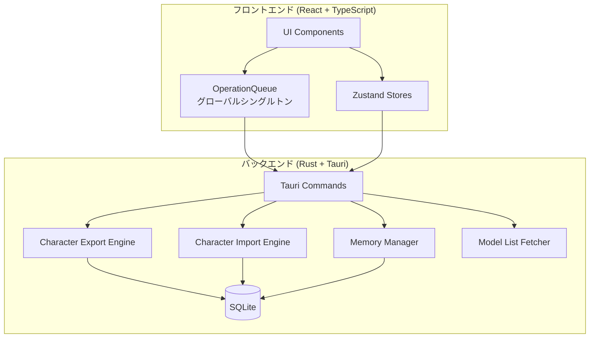
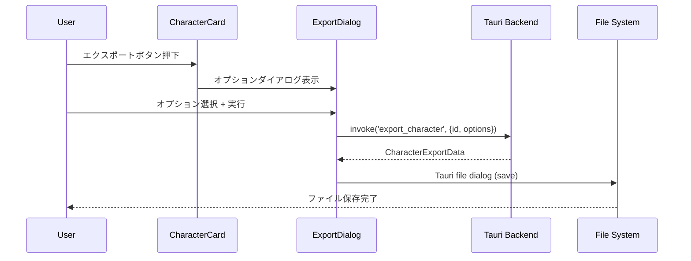

# 設計文書: App Enhancements V2

## Overview

AI Character Chatデスクトップアプリの包括的な機能強化。9つの要件を以下の3カテゴリに分類して設計する：

1. **データ管理**: キャラクターエクスポート/インポート（Req 1, 2）
2. **アーキテクチャ改善**: 非同期オペレーションキュー（Req 4）、キャラクターフォームスクロール修正（Req 3）
3. **UI/UX改善**: 手動メモリ生成（Req 5）、システムメッセージUX（Req 6）、TTS WIPラベル（Req 7）、モデル設定UI（Req 8）、条件付きボタン表示（Req 9）、ホバーアクション修正（Req 10）

## Architecture

### システム構成図



### 変更対象モジュール一覧

| モジュール | 変更内容 | 要件 |
|-----------|---------|------|
| `src-tauri/src/commands/character.rs` | export/importコマンド追加 | 1, 2 |
| `src/components/character/CharacterView.tsx` | インポートボタン追加、フォームスクロール修正 | 2, 3 |
| `src/components/character/CharacterCard.tsx` | エクスポートボタン追加 | 1 |
| `src/stores/operation-queue.ts` | グローバルキュー（新規） | 4 |
| `src/components/chat/ChatHeaderControls.tsx` | メモリ生成ボタン、条件付き表示 | 5, 9 |
| `src/components/chat/MessageBubble.tsx` | システムメッセージUX、条件付きTTSボタン、ホバー修正 | 6, 9, 10 |
| `src/components/settings/SettingsView.tsx` | TTS WIPバッジ | 7 |
| `src/components/settings/ModelConfigForm.tsx` | プロバイダー選択、モデル一覧取得 | 8 |

## Components and Interfaces

### 1. キャラクターエクスポート/インポート

#### エクスポートデータ形式（JSON）

```typescript
interface CharacterExportData {
  version: 1;
  exported_at: string; // ISO 8601
  character: {
    name: string;
    description: string;
    system_prompt: string;
    tts_config?: TTSConfig;
  };
  chat_sessions?: Array<{
    id: string;
    title?: string;
    created_at: string;
    messages: Array<{
      role: ChatRole;
      content: string;
      attachments?: MessageAttachment[];
      tool_calls?: ToolCall[];
      tool_call_id?: string;
      created_at: string;
    }>;
  }>;
  thoughts?: Array<{
    content: string;
    context?: string;
    created_at: string;
  }>;
  memories?: Array<{
    content: string;
    source_session_id?: string;
    created_at: string;
  }>;
}
```

#### エクスポートオプション

```typescript
interface ExportOptions {
  include_chats: boolean;
  include_thoughts: boolean;
  include_memories: boolean;
}
```

#### Rustバックエンドコマンド

```rust
// src-tauri/src/commands/character.rs に追加

#[tauri::command]
pub async fn export_character(
    character_id: String,
    options: ExportOptions,
    state: State<'_, AppState>,
) -> Result<CharacterExportData, AppError>;

#[tauri::command]
pub async fn import_character(
    data: CharacterExportData,
    options: ImportOptions,
    state: State<'_, AppState>,
) -> Result<Character, AppError>;
```

#### フロントエンドフロー



インポートフロー:
1. CharacterViewの「インポート」ボタン → Tauri file dialog (open)
2. ファイル読み込み → JSON解析 → バリデーション
3. インポートオプションダイアログ表示
4. `invoke('import_character', {data, options})` → 新規キャラクター作成
5. キャラクター一覧更新 + 成功トースト

#### ファイルダイアログ

Tauri v2の`@tauri-apps/plugin-dialog`を使用:
```typescript
import { save, open } from '@tauri-apps/plugin-dialog';
import { writeTextFile, readTextFile } from '@tauri-apps/plugin-fs';
```

### 2. キャラクターフォームスクロール修正

**現状の問題**: `CharacterView.tsx`でフォームの親`<div>`に`overflow-y-auto max-h-[70vh]`が設定されている。

**修正方針**: 
- フォーム親コンテナの`overflow-y-auto max-h-[70vh]`を削除
- CharacterView全体の`flex-1 flex flex-col overflow-hidden`構造を活用し、フォーム表示時はフォーム+リストを含む領域全体を`overflow-y-auto`にする

```tsx
// Before
<div className="mb-6 p-4 rounded-lg border border-border bg-card overflow-y-auto max-h-[70vh]">
  <CharacterForm ... />
</div>

// After
<div className="mb-6 p-4 rounded-lg border border-border bg-card">
  <CharacterForm ... />
</div>
```

親コンテナ（CharacterView全体のコンテンツ領域）で`overflow-y-auto`を制御する。

### 3. 非同期オペレーションキュー（グローバルシングルトン）

**現状の問題**: `useOperationQueue`はReactフックであり、コンポーネントのアンマウントでキュー状態が失われる。

**新設計**: Zustandストアとしてグローバルシングルトン化。

```typescript
// src/stores/operation-queue.ts (新規)
import { create } from 'zustand';

interface QueueTask {
  id: string;
  execute: () => Promise<void>;
  label?: string;
}

interface OperationQueueState {
  pendingCount: number;
  processing: boolean;
  currentTaskLabel: string | null;
  enqueue: (task: () => Promise<void>, label?: string) => void;
}

export const useOperationQueue = create<OperationQueueState>((set, get) => {
  let queue: QueueTask[] = [];
  let running = false;

  const processQueue = async () => {
    if (running) return;
    running = true;
    set({ processing: true });

    while (queue.length > 0) {
      const task = queue.shift()!;
      set({ currentTaskLabel: task.label ?? null, pendingCount: queue.length });
      try {
        await task.execute();
      } catch (e) {
        console.error('[OperationQueue] Task failed:', task.label, e);
      }
    }

    running = false;
    set({ processing: false, currentTaskLabel: null, pendingCount: 0 });
  };

  return {
    pendingCount: 0,
    processing: false,
    currentTaskLabel: null,
    enqueue: (execute, label) => {
      queue.push({ id: crypto.randomUUID(), execute, label });
      set({ pendingCount: queue.length });
      processQueue();
    },
  };
});
```

**移行**: 既存の`useOperationQueue`フックは非推奨とし、新しいZustandストアに段階的に移行。

### 4. 手動メモリ生成ボタン

**バックエンド**: 既存の`MemoryManager::check_and_compress`を呼び出す新コマンドを追加。

```rust
// src-tauri/src/commands/memory.rs に追加

/// 手動メモリ生成（閾値チェックをスキップして強制実行）
#[tauri::command]
pub async fn generate_memory_manual(
    session_id: String,
    state: State<'_, AppState>,
) -> Result<(), AppError> {
    state.memory_manager.force_compress(&session_id).await
}
```

`MemoryManager`に`force_compress`メソッドを追加。`check_and_compress`と同じロジックだが閾値チェックをスキップする。

**フロントエンド**: `ChatHeaderControls`にボタン追加。

```typescript
// ChatHeaderControls内
const handleGenerateMemory = async () => {
  const sessionId = useChatStore.getState().currentSessionId;
  if (!sessionId || memoryGenerating) return;
  setMemoryGenerating(true);
  try {
    await invoke('generate_memory_manual', { sessionId });
    showToast('記憶を生成した');
  } catch (e) {
    showToast(`記憶生成に失敗: ${e}`, 'error');
  } finally {
    setMemoryGenerating(false);
  }
};
```

### 5. システムメッセージのUX変更

**現状**: `MessageBubble.tsx`で`[SYSTEM]`プレフィックス付きメッセージは中央寄せの小さなバッジとして表示。ホバーアクションなし。

**変更後**: ユーザーメッセージと同じ扱い（右寄せ、編集・削除可能）。

```typescript
// MessageBubble.tsx の変更
// isSystemMessage判定は維持するが、表示ロジックを変更

if (isSystemMessage) {
  // 右寄せ + ユーザーメッセージと同じバブルスタイル
  // ホバー時に編集・削除ボタンを表示
  // 編集確定時は editAndResend を呼び出し（後続メッセージリセット）
  // 削除時は onDelete を呼び出し
}
```

`getRoleConfig`に`system`ケースを追加するのではなく、`isSystemMessage`フラグに基づいて既存のユーザーメッセージ表示ロジックを再利用する。

### 6. TTS WIPラベル

**変更箇所**: `SettingsView.tsx`のTABS定義。

```typescript
const TABS: { id: SettingsTab; label: string; badge?: string }[] = [
  { id: 'models', label: 'モデル設定' },
  { id: 'tts', label: 'TTS', badge: 'WIP' },
  // ...
];
```

タブボタンのレンダリングにバッジ表示を追加:
```tsx
{tab.badge && (
  <span className="ml-1 px-1.5 py-0.5 text-[10px] rounded bg-yellow-500/20 text-yellow-600">
    {tab.badge}
  </span>
)}
```

### 7. モデル設定UIの改善

#### プロバイダー定義

```typescript
type LLMProvider = 'openai' | 'anthropic' | 'google' | 'openai_compatible';

interface ProviderConfig {
  label: string;
  defaultBaseUrl?: string; // undefined = 必須入力
  supportsModelList: boolean;
}

const PROVIDERS: Record<LLMProvider, ProviderConfig> = {
  openai: { label: 'OpenAI', defaultBaseUrl: 'https://api.openai.com/v1', supportsModelList: true },
  anthropic: { label: 'Anthropic', defaultBaseUrl: 'https://api.anthropic.com/v1', supportsModelList: true },
  google: { label: 'Google', defaultBaseUrl: 'https://generativelanguage.googleapis.com/v1beta', supportsModelList: true },
  openai_compatible: { label: 'OpenAI互換', supportsModelList: true },
};
```

#### モデル一覧取得コマンド

```rust
// src-tauri/src/commands/config.rs に追加

#[tauri::command]
pub async fn fetch_available_models(
    base_url: String,
    api_key: Option<String>,
) -> Result<Vec<String>, AppError> {
    // GET {base_url}/models → response.data[].id を返却
    // OpenAI互換APIの /models エンドポイントを使用
}
```

#### UI動作

1. プロバイダー選択 → Base URLフィールドの必須/オプション切り替え
2. 既知プロバイダー選択時: Base URL未入力ならデフォルト値を使用
3. API Key入力後: 「モデル一覧取得」ボタンを表示
4. 取得成功: モデル名のドロップダウン + 手動入力のコンボボックス
5. 取得失敗: エラーメッセージ表示 + 手動テキスト入力のみ

### 8. 条件付きボタン表示制御

**実装方針**: `useConfigStore`からグローバル設定を読み取り、各コンポーネントで条件分岐。

```typescript
// ChatHeaderControls.tsx
const { config } = useConfigStore();
const thoughtEnabled = config?.thought?.enabled ?? false;
const spontaneousEnabled = config?.spontaneous?.enabled ?? false;

// 思考ボタン: thoughtEnabled === true の場合のみ表示
// 自発的発話ボタン: spontaneousEnabled === true の場合のみ表示
```

```typescript
// MessageBubble.tsx
const { config } = useConfigStore();
const ttsEnabled = config?.tts?.enabled ?? false;

// 音声生成ボタン: ttsEnabled === true の場合のみ表示（既に実装済み）
```

### 9. ホバーアクションボタンの修正

**問題分析**:
1. `pointer-events-none`が条件付きで適用されるが、`showMenu`がfalseの時にボタンがクリック不可になる
2. メッセージ削除後のDOMリフローでホバー状態がリセットされる

**修正方針**:

```tsx
// Before: pointer-events-noneがopacity-0と連動
<div className={`... ${showMenu ? 'opacity-100' : 'opacity-0 pointer-events-none'}`}>

// After: pointer-events-autoを常に維持し、visibilityで制御
<div className={`... pointer-events-auto ${showMenu ? 'opacity-100' : 'opacity-0 invisible'}`}>
```

追加修正:
- `onMouseLeave`でのステート更新にrequestAnimationFrameを使用し、ボタンクリック中のホバー解除を防止
- 削除アニメーション完了後に親要素のmouseenter/mouseleaveイベントを再バインドする必要はない（React合成イベントが自動処理）

## Data Models

### エクスポート/インポート用データ構造

既存のデータモデル（`Character`, `ChatSession`, `ChatMessageRecord`, `Thought`, `Memory`）をそのまま活用。エクスポート時にIDを除外し、インポート時に新規IDを生成する。

### ModelSettings拡張

```typescript
// src/types/config.ts に追加
export type LLMProvider = 'openai' | 'anthropic' | 'google' | 'openai_compatible';

// ModelSettingsにproviderフィールドを追加（オプション、後方互換）
export interface ModelSettings {
  provider?: LLMProvider;
  base_url: string;
  model: string;
  api_key?: string;
  temperature: number;
}
```

### OperationQueueState

```typescript
interface OperationQueueState {
  pendingCount: number;
  processing: boolean;
  currentTaskLabel: string | null;
  enqueue: (task: () => Promise<void>, label?: string) => void;
}
```

## Correctness Properties

*A property is a characteristic or behavior that should hold true across all valid executions of a system—essentially, a formal statement about what the system should do. Properties serve as the bridge between human-readable specifications and machine-verifiable correctness guarantees.*

### Property 1: エクスポート/インポート ラウンドトリップ

*For any* 有効なキャラクターデータ（name, description, system_prompt, tts_config）および関連データ（チャット履歴、思考、記憶）に対して、全オプションを有効にしてエクスポートし、その結果をインポートし、再度全オプションを有効にしてエクスポートした場合、2回のエクスポート結果のキャラクター設定・チャット内容・思考内容・記憶内容は等価である（IDとタイムスタンプを除く）。

**Validates: Requirements 1.2, 1.3, 1.4, 1.5, 1.6, 2.3, 2.4, 2.5, 2.6, 2.9**

### Property 2: 不正フォーマット拒否

*For any* 必須フィールド（version, character.name, character.description, character.system_prompt）のいずれかが欠落または不正な型を持つJSONデータに対して、インポート処理はエラーを返し、データベースに変更を加えない。

**Validates: Requirements 2.8**

### Property 3: キュー順序保証と障害耐性

*For any* タスク列（一部が例外をスローするタスクを含む）に対して、オペレーションキューは失敗しなかったタスクを追加順序通りに実行し、失敗タスクの後も後続タスクの実行を継続する。

**Validates: Requirements 4.3, 4.4**

### Property 4: キューのライフサイクル独立性

*For any* タスク列をキューに追加した後、キューを参照するコンポーネントがアンマウントされても、全タスクは最終的に実行完了する。

**Validates: Requirements 4.1, 4.2**

### Property 5: キュー状態の正確性

*For any* タスク追加・完了のシーケンスに対して、`pendingCount`は未実行タスク数と一致し、`processing`はキューにタスクが存在する間trueである。

**Validates: Requirements 4.5**

## Error Handling

### エクスポート/インポート

| エラー条件 | 対応 |
|-----------|------|
| ファイル書き込み失敗 | トースト通知「エクスポートに失敗: {詳細}」 |
| ファイル読み込み失敗 | トースト通知「ファイルの読み込みに失敗」 |
| JSON解析失敗 | トースト通知「ファイル形式が不正: JSONとして解析できない」 |
| バージョン不一致 | トースト通知「未対応のエクスポート形式（version: {n}）」 |
| 必須フィールド欠落 | トースト通知「必須データが不足: {フィールド名}」 |
| DB書き込み失敗 | トースト通知「インポートに失敗: {詳細}」、トランザクションロールバック |

### オペレーションキュー

| エラー条件 | 対応 |
|-----------|------|
| タスク実行失敗 | console.errorでログ出力、次タスクへ継続 |
| 全タスク失敗 | キューは空になり`processing: false`に遷移 |

### メモリ生成

| エラー条件 | 対応 |
|-----------|------|
| セッションなし | ボタンdisabled（currentSessionId === null時） |
| LLM呼び出し失敗 | トースト通知「記憶生成に失敗: {詳細}」 |
| メッセージ不足 | トースト通知「会話履歴が不足している」 |

### モデル一覧取得

| エラー条件 | 対応 |
|-----------|------|
| ネットワークエラー | フォーム内に非破壊的エラー表示、手動入力にフォールバック |
| 認証エラー | 「API Keyが無効」メッセージ表示 |
| レスポンス解析失敗 | 手動入力にフォールバック |

## Testing Strategy

### ユニットテスト

**バックエンド（Rust）**:
- `export_character`: 各オプション組み合わせでのデータ包含確認
- `import_character`: 正常系・異常系（不正JSON、欠落フィールド）
- `generate_memory_manual`: 強制圧縮の動作確認
- `fetch_available_models`: モックHTTPレスポンスでのパース確認

**フロントエンド（TypeScript）**:
- `OperationQueue`: タスク追加・実行・エラーハンドリング
- `ModelConfigForm`: プロバイダー選択に応じたフォーム状態遷移
- `MessageBubble`: システムメッセージの表示ロジック
- `ChatHeaderControls`: 条件付きボタン表示

### プロパティベーステスト

**ライブラリ**: Rust側は`proptest`（既にプロジェクトで使用中）

**テスト対象**:
- Property 1: ラウンドトリップ — ランダムなキャラクターデータ生成 → export → import → re-export → 比較
- Property 2: 不正フォーマット拒否 — ランダムな不正JSONデータ生成 → import → エラー確認
- Property 3: キュー順序保証 — ランダムなタスク列（成功/失敗混在）生成 → 実行順序確認
- Property 5: キュー状態正確性 — ランダムなenqueue/完了シーケンス → pendingCount/processing確認

**設定**:
- 各プロパティテスト: 最低100イテレーション
- タグ形式: `Feature: app-enhancements-v2, Property {number}: {property_text}`

### 統合テスト

- エクスポート→ファイル保存→ファイル読み込み→インポートのE2Eフロー
- モデル一覧取得の実API呼び出し（CI環境ではスキップ）

### 手動テスト

- キャラクターフォームのスクロール動作確認
- ホバーアクションボタンの操作感確認
- TTS WIPバッジの視覚確認
- 削除アニメーション後のホバー動作確認
