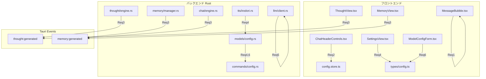
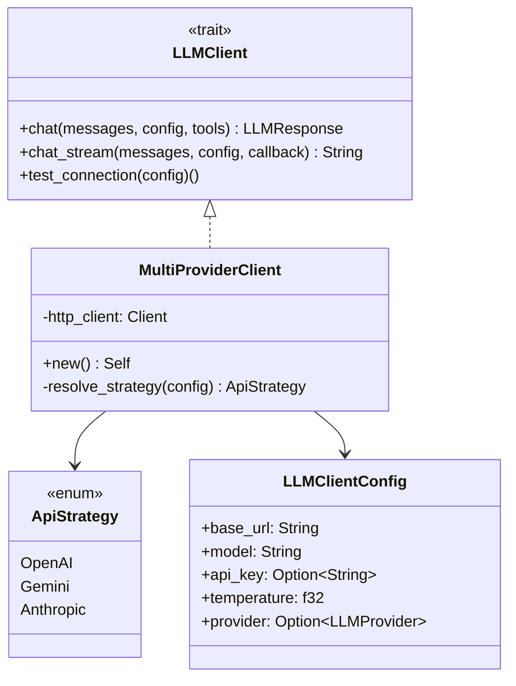

# 設計ドキュメント: app-enhancements-v3

## Overview

AI Character Chatアプリのv3機能強化。6つの独立した改善領域を含む:

1. **システムメッセージ表示の修正** — 右寄せバブルから中央寄せバッジへ変更
2. **TTS無効時のUI整理** — ボリュームコントロールの条件付き表示
3. **思考・記憶の即時反映** — Tauri Eventによるリアルタイム通知
4. **IrodoriTTS設定のグローバル化** — ベースURLの一元管理とモード別URL
5. **プロバイダー別API対応** — Google Gemini / Anthropic Messages APIネイティブ対応
6. **プロバイダー設定永続化修正** — ModelSettingsへのproviderフィールド追加

各領域は独立して実装可能だが、4と5はRust側のModelSettings変更（6）に依存する。

## Architecture

### 変更影響範囲



### 設計方針

- **最小変更原則**: 既存のアーキテクチャパターンを踏襲し、新規抽象化は最小限に
- **後方互換性**: 既存設定ファイルとの互換性を`#[serde(default)]`で維持
- **Strategy Pattern**: LLMクライアントのプロバイダー別処理にStrategy Patternを適用

## Components and Interfaces

### Requirement 1: システムメッセージバッジ表示

**変更対象**: `src/components/chat/MessageBubble.tsx`

現在のシステムメッセージ表示は右寄せバブルスタイル（ユーザーメッセージと同じ）を使用している。これを中央寄せのコンパクトなバッジスタイルに変更する。

```typescript
// MessageBubble.tsx 内のシステムメッセージ分岐
if (isSystemMessage) {
  return (
    <div className="group relative flex justify-center px-4 py-1">
      <div className="relative">
        <div className="inline-flex items-center gap-1.5 px-3 py-1 rounded-full 
                        bg-muted text-muted-foreground text-xs">
          <Info className="h-3 w-3" />
          <span>{displayContent}</span>
        </div>
        {/* ホバー時のアクションボタン */}
        <div className={`absolute -top-7 left-1/2 -translate-x-1/2 
                         flex items-center gap-0.5 transition-opacity
                         ${showMenu ? 'opacity-100' : 'opacity-0 invisible'}`}>
          <button onClick={handleEdit} ...>
            <Pencil className="h-3 w-3" />
          </button>
          <button onClick={handleDelete} ...>
            <Trash2 className="h-3 w-3" />
          </button>
        </div>
      </div>
    </div>
  );
}
```

### Requirement 2: TTS無効時のボリュームコントロール非表示

**変更対象**: `src/components/chat/ChatHeaderControls.tsx`

```typescript
// ChatHeaderControls.tsx
const ttsEnabled = config?.tts?.enabled ?? false;

return (
  <div className="flex items-center gap-1">
    {/* ボリュームコントロール — TTS有効時のみ表示 */}
    {ttsEnabled && (
      <div className="flex items-center gap-1 mr-2">
        <button onClick={() => setVolume(volume > 0 ? 0 : 1)} ...>
          {volume > 0 ? <Volume2 /> : <VolumeX />}
        </button>
        <input type="range" ... />
      </div>
    )}
    {/* 他のコントロール */}
  </div>
);
```

### Requirement 3: 思考・記憶生成の即時反映

**バックエンド変更**:
- `thought/engine.rs`: 既に`thought:generated`イベントを発行済み（変更不要）
- `memory/manager.rs` + `chat/engine.rs`: 記憶生成後に`memory:generated`イベントを発行

```rust
// memory/manager.rs — compress_internal内、Memory保存後
// AppHandleを受け取る形に変更するか、イベント発行をcommands層で行う

// commands/memory.rs or chat/engine.rs
#[derive(Clone, Serialize)]
pub struct MemoryGeneratedEvent {
    pub character_id: String,
    pub memory_id: String,
}

// 記憶生成後:
app_handle.emit("memory:generated", MemoryGeneratedEvent {
    character_id: memory.character_id.clone(),
    memory_id: memory.id.clone(),
})?;
```

**フロントエンド変更**:

```typescript
// ThoughtView.tsx — Tauri Eventリスナー追加
import { listen } from '@tauri-apps/api/event';

useEffect(() => {
  if (!selectedCharacterId) return;
  
  const unlisten = listen<{ character_id: string }>('thought:generated', (event) => {
    if (event.payload.character_id === selectedCharacterId) {
      loadThoughts();
    }
  });

  return () => { unlisten.then(fn => fn()); };
}, [selectedCharacterId, loadThoughts]);
```

```typescript
// MemoryView.tsx — 同様のパターン
useEffect(() => {
  if (!selectedCharacterId) return;
  
  const unlisten = listen<{ character_id: string }>('memory:generated', (event) => {
    if (event.payload.character_id === selectedCharacterId) {
      loadMemories();
    }
  });

  return () => { unlisten.then(fn => fn()); };
}, [selectedCharacterId, loadMemories]);
```

### Requirement 4: IrodoriTTSベースURL設定のグローバル化

**Rust側変更**: `models/config.rs`

```rust
/// TTS全体設定
#[derive(Debug, Clone, Serialize, Deserialize)]
pub struct TTSGlobalConfig {
    pub enabled: bool,
    #[serde(default)]
    pub voicepeak_path: Option<String>,
    #[serde(default = "default_tts_timeout")]
    pub timeout_seconds: u64,
    #[serde(default = "default_max_chunk_size")]
    pub max_chunk_size: usize,
    /// IrodoriTTSデフォルトベースURL（グローバル）
    #[serde(default)]
    pub irodori_base_url: Option<String>,
}
```

**TTSConfig変更**: `models/tts.rs`

```rust
/// TTS設定（キャラクター個別）
#[derive(Debug, Clone, Serialize, Deserialize)]
pub struct TTSConfig {
    pub provider: TTSProvider,
    /// Irodori-TTS用ベースURL（キャラクター個別オーバーライド）
    #[serde(default)]
    pub base_url: Option<String>,
    /// Irodori-TTS: キャプションモード用ベースURL
    #[serde(default)]
    pub caption_base_url: Option<String>,
    /// Irodori-TTS: 参照音声モード用ベースURL
    #[serde(default)]
    pub reference_audio_base_url: Option<String>,
    // ... 既存フィールド
}
```

**ベースURL解決ロジック**:

```rust
/// IrodoriTTSのベースURLを解決する
/// 優先順位: キャラクター個別(モード別) > キャラクター個別(共通) > グローバル設定
pub fn resolve_irodori_base_url(
    char_config: &TTSConfig,
    global_config: &TTSGlobalConfig,
) -> Option<String> {
    // 1. モード別URL（キャラクター個別）
    let mode_url = match char_config.irodori_mode {
        Some(IrodoriMode::Caption) => char_config.caption_base_url.clone(),
        Some(IrodoriMode::ReferenceAudio) => char_config.reference_audio_base_url.clone(),
        None => None,
    };
    if mode_url.is_some() {
        return mode_url;
    }

    // 2. キャラクター個別の共通ベースURL
    if char_config.base_url.is_some() {
        return char_config.base_url.clone();
    }

    // 3. グローバル設定のベースURL
    global_config.irodori_base_url.clone()
}
```

**TypeScript側変更**: `types/config.ts`

```typescript
export interface TTSGlobalConfig {
  enabled: boolean;
  voicepeak_path?: string;
  timeout_seconds?: number;
  max_chunk_size?: number;
  /** IrodoriTTSデフォルトベースURL */
  irodori_base_url?: string;
}
```

### Requirement 5: プロバイダー別API仕様対応

**設計方針**: Strategy Patternで各プロバイダーのリクエスト構築・レスポンスパースを分離。



**LLMClientConfig変更**:

```rust
/// LLMプロバイダー種別
#[derive(Debug, Clone, Serialize, Deserialize, PartialEq)]
#[serde(rename_all = "snake_case")]
pub enum LLMProvider {
    Openai,
    Anthropic,
    Google,
    OpenaiCompatible,
}

/// LLMクライアント接続設定
#[derive(Debug, Clone, Serialize, Deserialize)]
pub struct LLMClientConfig {
    pub base_url: String,
    pub model: String,
    pub api_key: Option<String>,
    pub temperature: f32,
    /// プロバイダー種別（API形式判定に使用）
    #[serde(default)]
    pub provider: Option<LLMProvider>,
}
```

**API形式判定ロジック**:

```rust
/// プロバイダーとエンドポイント設定からAPI形式を決定
fn resolve_api_strategy(config: &LLMClientConfig) -> ApiStrategy {
    match config.provider {
        Some(LLMProvider::Google) => {
            // デフォルトエンドポイント使用時のみGemini API形式
            if is_default_endpoint(&config.base_url, LLMProvider::Google) {
                ApiStrategy::Gemini
            } else {
                ApiStrategy::OpenAI // カスタムエンドポイント → OpenAI互換
            }
        }
        Some(LLMProvider::Anthropic) => {
            if is_default_endpoint(&config.base_url, LLMProvider::Anthropic) {
                ApiStrategy::Anthropic
            } else {
                ApiStrategy::OpenAI
            }
        }
        Some(LLMProvider::Openai) | Some(LLMProvider::OpenaiCompatible) | None => {
            ApiStrategy::OpenAI
        }
    }
}

fn is_default_endpoint(base_url: &str, provider: LLMProvider) -> bool {
    let url = base_url.trim_end_matches('/');
    match provider {
        LLMProvider::Google => {
            url.is_empty() || url.contains("generativelanguage.googleapis.com")
        }
        LLMProvider::Anthropic => {
            url.is_empty() || url.contains("api.anthropic.com")
        }
        _ => true,
    }
}
```

**Google Gemini APIリクエスト構築**:

```rust
fn build_gemini_request(messages: &[ChatMessage], config: &LLMClientConfig) -> Value {
    // Gemini API: POST /models/{model}:generateContent
    let contents: Vec<Value> = messages.iter()
        .filter(|m| m.role != MessageRole::System)
        .map(|m| {
            let role = match m.role {
                MessageRole::User => "user",
                MessageRole::Assistant => "model",
                _ => "user",
            };
            serde_json::json!({
                "role": role,
                "parts": [{"text": m.content}]
            })
        })
        .collect();

    let system_instruction = messages.iter()
        .find(|m| m.role == MessageRole::System)
        .map(|m| serde_json::json!({"parts": [{"text": m.content}]}));

    let mut body = serde_json::json!({
        "contents": contents,
        "generationConfig": {
            "temperature": config.temperature,
        }
    });

    if let Some(si) = system_instruction {
        body["systemInstruction"] = si;
    }

    body
}
```

**Anthropic Messages APIリクエスト構築**:

```rust
fn build_anthropic_request(messages: &[ChatMessage], config: &LLMClientConfig) -> Value {
    // Anthropic: POST /messages
    let system_text = messages.iter()
        .filter(|m| m.role == MessageRole::System)
        .map(|m| m.content.as_str())
        .collect::<Vec<_>>()
        .join("\n");

    let api_messages: Vec<Value> = messages.iter()
        .filter(|m| m.role != MessageRole::System)
        .map(|m| {
            let role = match m.role {
                MessageRole::User => "user",
                MessageRole::Assistant => "assistant",
                _ => "user",
            };
            serde_json::json!({
                "role": role,
                "content": m.content
            })
        })
        .collect();

    let mut body = serde_json::json!({
        "model": config.model,
        "messages": api_messages,
        "temperature": config.temperature,
        "max_tokens": 4096,
    });

    if !system_text.is_empty() {
        body["system"] = Value::String(system_text);
    }

    body
}
```

**レスポンスパース**:

```rust
fn parse_gemini_response(body: &Value) -> Result<LLMResponse, AppError> {
    let text = body["candidates"][0]["content"]["parts"][0]["text"]
        .as_str()
        .unwrap_or("")
        .to_string();
    Ok(LLMResponse::Text(text))
}

fn parse_anthropic_response(body: &Value) -> Result<LLMResponse, AppError> {
    let content = body["content"].as_array()
        .ok_or_else(|| AppError::LlmApi("Invalid Anthropic response".to_string()))?;
    let text = content.iter()
        .filter_map(|block| block["text"].as_str())
        .collect::<Vec<_>>()
        .join("");
    Ok(LLMResponse::Text(text))
}
```

### Requirement 6: プロバイダー設定の永続化バグ修正

**Rust側変更**: `models/config.rs`

```rust
/// LLMモデル接続設定
#[derive(Debug, Clone, Serialize, Deserialize)]
pub struct ModelSettings {
    /// プロバイダー種別（後方互換のためOption型）
    #[serde(default)]
    pub provider: Option<LLMProvider>,
    pub base_url: String,
    pub model: String,
    pub api_key: Option<String>,
    pub temperature: f32,
}
```

`#[serde(default)]`により、既存の設定ファイルにproviderフィールドがない場合は`None`としてデシリアライズされ、後方互換性を維持する。

**commands/config.rs変更**: `test_llm_connection`でprovider情報をLLMClientConfigに渡す

```rust
#[tauri::command]
pub async fn test_llm_connection(
    settings: ModelSettings,
    state: State<'_, AppState>,
) -> Result<(), AppError> {
    let config = LLMClientConfig {
        base_url: settings.base_url,
        model: settings.model,
        api_key: settings.api_key,
        temperature: settings.temperature,
        provider: settings.provider,
    };
    state.llm_client.test_connection(&config).await
}
```

## Data Models

### Rust側変更まとめ

| 構造体 | フィールド追加 | 備考 |
|--------|---------------|------|
| `ModelSettings` | `provider: Option<LLMProvider>` | `#[serde(default)]` |
| `TTSGlobalConfig` | `irodori_base_url: Option<String>` | `#[serde(default)]` |
| `TTSConfig` | `caption_base_url: Option<String>` | `#[serde(default)]` |
| `TTSConfig` | `reference_audio_base_url: Option<String>` | `#[serde(default)]` |
| `LLMClientConfig` | `provider: Option<LLMProvider>` | API形式判定用 |

### TypeScript側変更まとめ

| インターフェース | フィールド追加 | 備考 |
|-----------------|---------------|------|
| `TTSGlobalConfig` | `irodori_base_url?: string` | グローバルIrodoriTTS URL |

### 新規イベント型

```rust
/// 記憶生成完了イベント
#[derive(Clone, Serialize)]
pub struct MemoryGeneratedEvent {
    pub character_id: String,
    pub memory_id: String,
}
```

### LLMProvider enum（Rust側新規）

```rust
#[derive(Debug, Clone, Serialize, Deserialize, PartialEq)]
#[serde(rename_all = "snake_case")]
pub enum LLMProvider {
    Openai,
    Anthropic,
    Google,
    OpenaiCompatible,
}
```

## Correctness Properties

*A property is a characteristic or behavior that should hold true across all valid executions of a system—essentially, a formal statement about what the system should do. Properties serve as the bridge between human-readable specifications and machine-verifiable correctness guarantees.*

### Property 1: IrodoriTTSベースURL解決の優先順位

*For any* TTSConfig（キャラクター個別設定）とTTSGlobalConfig（グローバル設定）の組み合わせにおいて、`resolve_irodori_base_url`関数は以下の優先順位でURLを返す:
1. キャラクター個別のモード別URL（caption_base_url / reference_audio_base_url）が設定されている場合はそれを返す
2. キャラクター個別の共通base_urlが設定されている場合はそれを返す
3. グローバル設定のirodori_base_urlが設定されている場合はそれを返す
4. いずれも未設定の場合はNoneを返す

**Validates: Requirements 4.3, 4.4**

### Property 2: プロバイダー×エンドポイントによるAPI形式決定

*For any* LLMClientConfig値において、`resolve_api_strategy`関数は以下のルールに従ってAPI形式を決定する:
- provider=Google かつ デフォルトエンドポイント → Gemini形式
- provider=Anthropic かつ デフォルトエンドポイント → Anthropic形式
- provider=Google/Anthropic かつ カスタムエンドポイント → OpenAI形式
- provider=OpenAI/OpenaiCompatible/None → OpenAI形式

**Validates: Requirements 5.1, 5.2, 5.3, 5.4, 5.5**

### Property 3: プロバイダー別レスポンスパースの正当性

*For any* 有効なGemini APIレスポンスJSON、`parse_gemini_response`はテキストコンテンツを正しく抽出してLLMResponse::Textを返す。同様に、*for any* 有効なAnthropic APIレスポンスJSON、`parse_anthropic_response`はテキストコンテンツを正しく抽出してLLMResponse::Textを返す。

**Validates: Requirements 5.7**

### Property 4: ModelSettingsシリアライズ/デシリアライズ ラウンドトリップ

*For any* 有効なModelSettings値（provider=Some/None含む）、JSONへのシリアライズ後にデシリアライズした結果は元の値と等価な内容を含む。また、providerフィールドが存在しないJSONからデシリアライズした場合、provider=Noneとして正しく読み込まれる。

**Validates: Requirements 6.2, 6.3, 6.5, 6.6**

## Error Handling

### Requirement 3: イベント発行失敗

- `app_handle.emit()`が失敗した場合、ログ出力のみで処理を継続（記憶/思考の生成自体は成功扱い）
- フロントエンドのイベントリスナーでエラーが発生した場合、コンソールログに記録し、手動リロードで回復可能

### Requirement 4: ベースURL未設定

- グローバル設定もキャラクター個別設定もベースURLが未設定の場合、`resolve_irodori_base_url`はNoneを返す
- 呼び出し元（`irodori.rs`）でNoneの場合は`AppError::Tts("IrodoriTTS base URL is not configured")`を返す

### Requirement 5: API通信エラー

- 各プロバイダーのHTTPエラーレスポンスは既存の`AppError::LlmApi`にマッピング
- レスポンスパース失敗時も`AppError::LlmApi`で詳細メッセージを含める
- Gemini APIの`candidates`が空の場合（safety filter等）は適切なエラーメッセージを返す

### Requirement 6: 後方互換性

- `#[serde(default)]`によりフィールド欠損時はデフォルト値（None）を使用
- デシリアライズ失敗時は既存のエラーハンドリング（`AppError::Serialization`）で処理

## Testing Strategy

### プロパティベーステスト（proptest）

本プロジェクトでは既に`proptest`クレートを使用している。以下のプロパティテストを追加:

| Property | テストファイル | 最小反復回数 |
|----------|--------------|-------------|
| Property 1: URL解決優先順位 | `src-tauri/src/tts/property_tests.rs` | 100 |
| Property 2: API形式決定 | `src-tauri/src/llm/property_tests.rs` | 100 |
| Property 3: レスポンスパース | `src-tauri/src/llm/property_tests.rs` | 100 |
| Property 4: ModelSettingsラウンドトリップ | `src-tauri/src/config/property_tests.rs` | 100 |

各テストには以下のタグコメントを付与:
```rust
// Feature: app-enhancements-v3, Property 1: IrodoriTTSベースURL解決の優先順位
```

### ユニットテスト

| 対象 | テスト内容 |
|------|-----------|
| MessageBubble | システムメッセージが中央寄せバッジで表示されること |
| ChatHeaderControls | TTS無効時にボリュームコントロールが非表示 |
| resolve_api_strategy | 各プロバイダー×エンドポイントの組み合わせ |
| build_gemini_request | Gemini API形式のリクエストボディ構築 |
| build_anthropic_request | Anthropic API形式のリクエストボディ構築 |
| parse_gemini_response | Geminiレスポンスのパース |
| parse_anthropic_response | Anthropicレスポンスのパース |

### 統合テスト

| 対象 | テスト内容 |
|------|-----------|
| ThoughtView + Tauri Event | thought:generatedイベント受信時の再取得 |
| MemoryView + Tauri Event | memory:generatedイベント受信時の再取得 |
| 設定保存→読み込み | provider値の永続化と復元 |
