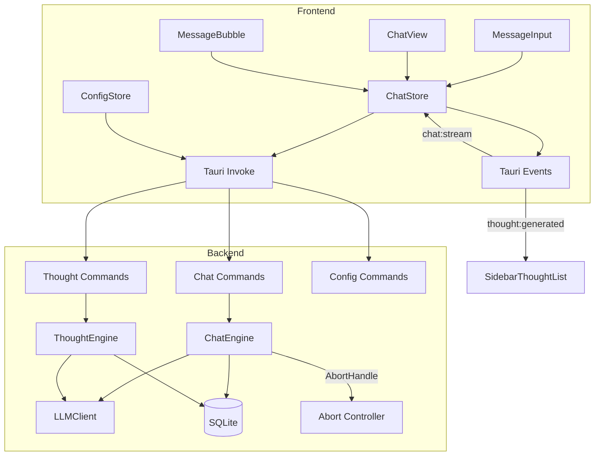

# Design Document: Chat UX Improvements

## Overview

AI Character Chat アプリケーションのチャットUXを包括的に改善する設計。11の要件を以下の3カテゴリに分類して実装する:

1. **バックエンド拡張** — 思考自動削除、思考のチャット反映、生成停止、メッセージ編集・再生成
2. **フロントエンド改善** — フォーカス保持、スムーズスクロール、Markdownレンダリング、送信キー設定、削除ボタン表示修正
3. **UI制御** — 思考/自発的発話の一時停止トグル

### 技術スタック

- **Frontend**: React 19 + TypeScript + Zustand 5 + Tailwind CSS 3
- **Backend**: Rust + Tauri 2 (SQLite via rusqlite)
- **テスト**: Vitest + fast-check (frontend), proptest (backend)
- **新規依存**: `react-markdown`, `remark-gfm`, `rehype-highlight`, `rehype-sanitize` (Markdown rendering)

## Architecture



### 変更の影響範囲

| 要件 | Backend変更 | Frontend変更 | Config変更 |
|------|------------|-------------|-----------|
| 1. Thought Auto-Delete | ThoughtEngine, thought_repo | ThoughtView | AppConfig.thought |
| 2. Thoughts in Chat | ChatEngine.build_context | — | — |
| 3. Focus Retention | — | MessageInput | — |
| 4. Regeneration | ChatEngine (新コマンド) | ChatStore, ChatView | — |
| 5. Stop Generation | ChatEngine (abort) | ChatStore, ChatView, MessageInput | — |
| 6. Smooth Scrolling | — | ChatView | — |
| 7. Message Editing | ChatEngine (新コマンド) | MessageBubble, ChatStore | — |
| 8. Pause Thought/Spontaneous | ThoughtEngine, SpontaneousEngine | ChatView (header) | — |
| 9. Markdown Rendering | — | MessageBubble (新) | — |
| 10. Send Key Config | — | MessageInput, SettingsView | AppConfig.ui |
| 11. Delete Button Fix | — | MessageBubble, ChatView (CSS) | — |

## Components and Interfaces

### Backend: New Tauri Commands

```rust
// --- Thought Auto-Deletion ---
#[tauri::command]
pub async fn delete_thought(id: String, state: State<'_, AppState>) -> Result<(), AppError>;

#[tauri::command]
pub async fn list_thoughts(character_id: String, state: State<'_, AppState>) -> Result<Vec<Thought>, AppError>;

// --- Chat Regeneration ---
#[tauri::command]
pub async fn regenerate_message(
    session_id: String,
    message_id: String,  // 再生成対象のassistantメッセージID
    app_handle: AppHandle,
    state: State<'_, AppState>,
) -> Result<(), AppError>;

// --- Stop Generation ---
#[tauri::command]
pub async fn stop_generation(
    session_id: String,
    state: State<'_, AppState>,
) -> Result<(), AppError>;

// --- Message Editing ---
#[tauri::command]
pub async fn edit_and_resend(
    session_id: String,
    message_id: String,      // 編集対象のuserメッセージID
    new_content: String,
    app_handle: AppHandle,
    state: State<'_, AppState>,
) -> Result<(), AppError>;

// --- Pause/Resume ---
#[tauri::command]
pub async fn pause_thought_engine(state: State<'_, AppState>) -> Result<(), AppError>;

#[tauri::command]
pub async fn resume_thought_engine(
    app_handle: AppHandle,
    state: State<'_, AppState>,
) -> Result<(), AppError>;

#[tauri::command]
pub async fn pause_spontaneous(state: State<'_, AppState>) -> Result<(), AppError>;

#[tauri::command]
pub async fn resume_spontaneous(state: State<'_, AppState>) -> Result<(), AppError>;
```

### Backend: ChatEngine Changes

```rust
impl DefaultChatEngine {
    /// ストリーミング中のAbortHandle管理
    /// session_id → AbortHandle のマップ
    active_streams: Arc<Mutex<HashMap<String, tokio::task::AbortHandle>>>,

    /// 思考コンテキストを含むbuild_context拡張
    pub(crate) fn build_context(
        &self,
        system_prompt: &str,
        memories: &[Memory],
        thoughts: &[Thought],  // 新規追加
        history: &[ChatMessageRecord],
        user_content: &str,
        attachment_text: Option<&str>,
    ) -> Vec<ChatMessage>;

    /// メッセージ再生成（既存メッセージ削除 → 再送信）
    pub async fn regenerate(
        &self,
        session_id: &str,
        target_message_id: &str,
        app_handle: &AppHandle,
    ) -> Result<(), AppError>;

    /// メッセージ編集＋再送信（後続メッセージ削除 → 更新 → 再送信）
    pub async fn edit_and_resend(
        &self,
        session_id: &str,
        message_id: &str,
        new_content: &str,
        app_handle: &AppHandle,
    ) -> Result<(), AppError>;

    /// ストリーミング中断
    pub fn abort_stream(&self, session_id: &str) -> Result<String, AppError>;
}
```

### Backend: ThoughtEngine Changes

```rust
impl DefaultThoughtEngine {
    /// 閾値を超えた古い思考を削除
    pub async fn cleanup_old_thoughts(
        &self,
        character_id: &str,
        threshold_minutes: u64,
    ) -> Result<u32, AppError>;  // 削除件数を返す
}

// thought_repo に追加
pub fn delete_thought(conn: &Connection, id: &str) -> Result<(), AppError>;
pub fn delete_thoughts_older_than(
    conn: &Connection,
    character_id: &str,
    cutoff_time: &str,
) -> Result<u32, AppError>;
pub fn get_recent_thoughts(
    conn: &Connection,
    character_id: &str,
    since: &str,
) -> Result<Vec<Thought>, AppError>;
```

### Frontend: ChatStore Extensions

```typescript
interface ChatState {
  // 既存フィールド...
  
  // 新規追加
  isAbortable: boolean;
  editingMessageId: string | null;
  
  // 新規アクション
  regenerateMessage: (messageId: string) => Promise<void>;
  stopGeneration: () => Promise<void>;
  editAndResend: (messageId: string, newContent: string) => Promise<void>;
  setEditingMessage: (messageId: string | null) => void;
}
```

### Frontend: ConfigStore Extensions

```typescript
// AppConfig.thought に追加
interface ThoughtConfig {
  enabled: boolean;
  interval_minutes: number;
  auto_delete_threshold_minutes: number;  // 新規: デフォルト1440
}

// AppConfig.ui に追加
interface UIConfig {
  theme: Theme;
  language: string;
  send_key: 'enter' | 'ctrl_enter' | 'shift_enter';  // 新規: デフォルト 'enter'
}
```

### Frontend: New Components

```typescript
// MarkdownRenderer — メッセージのMarkdown表示
interface MarkdownRendererProps {
  content: string;
  className?: string;
}

// EditableMessage — メッセージ編集UI
interface EditableMessageProps {
  originalContent: string;
  onConfirm: (newContent: string) => void;
  onCancel: () => void;
}

// ChatHeaderControls — 思考/自発的発話の一時停止トグル
interface ChatHeaderControlsProps {
  thoughtPaused: boolean;
  spontaneousPaused: boolean;
  onToggleThought: () => void;
  onToggleSpontaneous: () => void;
}
```

## Data Models

### Config Model Changes (Rust)

```rust
/// 独自思考設定（拡張）
#[derive(Debug, Clone, Serialize, Deserialize)]
pub struct ThoughtConfig {
    pub enabled: bool,
    pub interval_minutes: u64,
    /// 自動削除閾値（分）。0 = 無効（全保持）
    #[serde(default = "default_thought_auto_delete_threshold")]
    pub auto_delete_threshold_minutes: u64,
}

fn default_thought_auto_delete_threshold() -> u64 {
    1440  // 24時間
}

/// UI設定（拡張）
#[derive(Debug, Clone, Serialize, Deserialize)]
pub struct UIConfig {
    pub theme: Theme,
    pub language: String,
    /// メッセージ送信キー設定
    #[serde(default = "default_send_key")]
    pub send_key: SendKey,
}

#[derive(Debug, Clone, Serialize, Deserialize, PartialEq)]
#[serde(rename_all = "snake_case")]
pub enum SendKey {
    Enter,
    CtrlEnter,
    ShiftEnter,
}

fn default_send_key() -> SendKey {
    SendKey::Enter
}
```

### Config Model Changes (TypeScript)

```typescript
export type SendKey = 'enter' | 'ctrl_enter' | 'shift_enter';

export interface ThoughtConfig {
  enabled: boolean;
  interval_minutes: number;
  auto_delete_threshold_minutes: number;
}

export interface UIConfig {
  theme: Theme;
  language: string;
  send_key: SendKey;
}
```

### Abort State Management

```rust
/// ストリーミング中断管理（AppStateに追加）
pub struct StreamAbortManager {
    /// session_id → (AbortHandle, partial_content)
    active: Mutex<HashMap<String, (tokio::task::AbortHandle, Arc<Mutex<String>>)>>,
}

impl StreamAbortManager {
    pub fn register(&self, session_id: &str, handle: tokio::task::AbortHandle, content: Arc<Mutex<String>>);
    pub fn abort(&self, session_id: &str) -> Option<String>;  // 部分コンテンツを返す
    pub fn remove(&self, session_id: &str);
}
```

### Database Schema (No Migration Needed)

既存の `thoughts` テーブルと `chat_messages` テーブルはそのまま使用。新規テーブル追加なし。
`delete_thought`, `delete_thoughts_older_than`, `delete_messages_after` は既存スキーマに対するDELETE操作のみ。


## Correctness Properties

*A property is a characteristic or behavior that should hold true across all valid executions of a system—essentially, a formal statement about what the system should do. Properties serve as the bridge between human-readable specifications and machine-verifiable correctness guarantees.*

### Property 1: Thought auto-deletion preserves only recent thoughts

*For any* set of thoughts with varying `created_at` timestamps and *for any* non-zero `auto_delete_threshold_minutes` value, after running cleanup, all remaining thoughts SHALL have `created_at` within the threshold period from the current time, and all thoughts beyond the threshold SHALL have been deleted. When threshold is 0, all thoughts SHALL be retained regardless of age.

**Validates: Requirements 1.2, 1.5**

### Property 2: Manual thought deletion removes exactly the target

*For any* thought stored in the database, calling `delete_thought` with that thought's ID SHALL result in that thought no longer existing in the database, while all other thoughts for the same character remain unchanged.

**Validates: Requirements 1.3**

### Property 3: Thought context inclusion respects threshold

*For any* set of thoughts with varying timestamps and *for any* threshold configuration, `build_context` SHALL include exactly those thoughts whose `created_at` is within the threshold period as system messages in the prompt. When no thoughts exist within the threshold, the prompt SHALL contain no thought context messages.

**Validates: Requirements 2.1, 2.2, 2.3**

### Property 4: Regeneration replaces target message correctly

*For any* chat session with at least one user-assistant message pair, regenerating an assistant message SHALL delete that assistant message from the database AND correctly identify the immediately preceding user message as the content to resend.

**Validates: Requirements 4.1, 4.2**

### Property 5: Abort preserves partial content

*For any* non-empty partial content string accumulated during streaming, when generation is aborted, the partial content SHALL be saved as the final assistant message content in the database.

**Validates: Requirements 5.3**

### Property 6: Auto-scroll pauses when user scrolls away

*For any* scroll position where `(scrollHeight - scrollTop - clientHeight) > 200`, auto-scrolling SHALL be paused. *For any* scroll position where `(scrollHeight - scrollTop - clientHeight) <= 200`, auto-scrolling SHALL be active.

**Validates: Requirements 6.2, 6.3**

### Property 7: Message edit truncates history and updates content

*For any* chat session with N messages and *for any* user message at position K (where K < N), editing that message SHALL delete all messages at positions > K, update the message at position K with the new content, and the resulting history SHALL contain exactly K messages.

**Validates: Requirements 7.3, 7.4**

### Property 8: Markdown sanitization prevents XSS

*For any* input string (including strings containing `<script>`, `onclick`, `onerror`, `javascript:` URIs, and other XSS vectors), the sanitized Markdown render output SHALL NOT contain executable JavaScript — no `<script>` elements, no `on*` event handler attributes, and no `javascript:` protocol links.

**Validates: Requirements 9.3**

### Property 9: Send key configuration determines send/newline behavior

*For any* `send_key` configuration value (`enter`, `ctrl_enter`, `shift_enter`) and *for any* non-empty message content, pressing the configured key combination SHALL trigger message send, while pressing any other Enter-modifier combination SHALL insert a newline character without sending.

**Validates: Requirements 10.2, 10.3**

## Error Handling

### Backend Errors

| エラー状況 | 処理 |
|-----------|------|
| 思考削除時にIDが存在しない | `AppError::NotFound` を返す |
| 再生成時にメッセージIDが存在しない | `AppError::NotFound` を返す |
| 再生成時に先行するuserメッセージがない | `AppError::InvalidInput` を返す |
| ストリーミング中断時にアクティブなストリームがない | 何もせず `Ok(())` を返す |
| 編集対象メッセージがuser roleでない | `AppError::InvalidInput` を返す |
| LLM接続エラー（再生成/編集時） | `AppError::LlmApi` を返し、部分的な変更（メッセージ削除）はロールバックしない |
| 思考自動削除中のDBエラー | ログ出力のみ、思考生成自体は続行 |

### Frontend Error Handling

| エラー状況 | UI表示 |
|-----------|--------|
| 再生成失敗 | エラーバナー表示、isStreaming を false に戻す |
| 停止コマンド失敗 | 無視（ストリーミングは自然完了を待つ） |
| 編集・再送信失敗 | エラーバナー表示、編集モードを解除 |
| Markdown レンダリングエラー | フォールバックとしてプレーンテキスト表示 |
| 思考/自発的発話の一時停止失敗 | トグル状態を元に戻し、エラートースト表示 |

### Graceful Degradation

- ストリーミング中断が間に合わない場合（レスポンスが既に完了）→ 通常の完了として処理
- `react-markdown` のロードに失敗した場合 → `whitespace-pre-wrap` でプレーンテキスト表示
- 設定ファイルに `send_key` フィールドがない場合 → `#[serde(default)]` によりデフォルト値 `enter` を使用

## Testing Strategy

### Property-Based Tests (Backend — Rust with proptest)

各プロパティテストは最低100イテレーション実行。

| Property | テスト対象 | ジェネレータ |
|----------|-----------|-------------|
| 1: Thought auto-deletion | `cleanup_old_thoughts` | ランダムなThoughtリスト（0〜50件）、ランダムなtimestamp、ランダムなthreshold（0〜2880分） |
| 2: Manual deletion | `delete_thought` | ランダムなThought ID、ランダムな既存Thoughtセット |
| 3: Thought context | `build_context` (思考含む版) | ランダムなThoughtリスト、ランダムなthreshold、ランダムなsystem_prompt |
| 4: Regeneration | `regenerate` ロジック | ランダムなメッセージ履歴（2〜20件、user/assistant交互） |
| 5: Abort preserves | `abort_stream` | ランダムな部分コンテンツ文字列（0〜10000文字） |
| 7: Edit truncation | `edit_and_resend` ロジック | ランダムなメッセージ履歴、ランダムな編集位置 |

### Property-Based Tests (Frontend — TypeScript with fast-check)

| Property | テスト対象 | ジェネレータ |
|----------|-----------|-------------|
| 6: Auto-scroll | `shouldAutoScroll` 関数 | ランダムなscrollHeight, scrollTop, clientHeight |
| 8: XSS sanitization | MarkdownRenderer | ランダムな文字列（XSSペイロード含む） |
| 9: Send key | `handleKeyDown` ロジック | ランダムなsend_key設定、ランダムなキーイベント |

### Unit Tests (Example-Based)

| 対象 | テスト内容 |
|------|-----------|
| MessageInput | フォーカス保持（送信後にtextareaがfocusedであること） |
| MessageInput | 各send_key設定での送信/改行動作 |
| MessageBubble | ユーザーメッセージにeditボタン表示 |
| MessageBubble | アシスタントメッセージにregenerateボタン表示 |
| ChatView | isStreaming時にstopボタン表示 |
| ChatView | 削除アニメーション後のボタンアクセシビリティ |
| ChatHeaderControls | トグル状態の表示 |
| MarkdownRenderer | コードブロックのシンタックスハイライト＋コピーボタン |
| SettingsView | send_keyドロップダウンの表示 |
| ThoughtView | 各思考エントリに削除ボタン表示 |

### Integration Tests

| 対象 | テスト内容 |
|------|-----------|
| 思考生成→自動削除フロー | ThoughtEngine.generate_thought 後に古い思考が削除されること |
| 再生成フロー | regenerate_message コマンド → DB状態 → イベント発火 |
| 編集→再送信フロー | edit_and_resend コマンド → 後続削除 → 新レスポンス生成 |
| 一時停止/再開 | pause → 思考生成されない → resume → 生成再開 |

### Test Configuration

- **proptest**: `ProptestConfig { cases: 100, .. }` (Rust backend)
- **fast-check**: `fc.assert(property, { numRuns: 100 })` (TypeScript frontend)
- **タグフォーマット**: `Feature: chat-ux-improvements, Property {N}: {property_text}`
