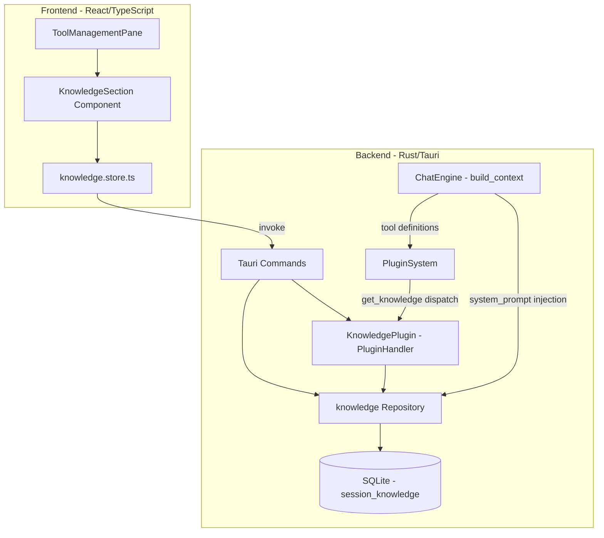

# Design Document: Knowledge Plugin

## Overview

Knowledge Pluginは、チャットセッションごとにテキストファイルを「ナレッジ」として管理するビルトインプラグイン。既存の`file_ops`プラグインと同様に`PluginHandler`トレイトを実装し、`PluginSystem`経由でエンジンから呼び出される。

主要な責務:
- ファイル内容のスナップショット保存（session_knowledge テーブル）
- 2種類の注入モード管理（system_prompt / tool_reference）
- `get_knowledge`ツールの動的提供（tool_reference モード時）
- Tauri コマンド経由でのフロントエンドとの連携

設計方針:
- 既存プラグインパターン（`file_ops.rs`）に準拠した実装構造
- エンジン側の`build_context`メソッドを拡張してナレッジ注入ロジックを組み込む
- フロントエンドはZustandストアで状態管理し、ToolManagementPaneに統合

## Architecture



### データフロー

1. **追加フロー**: DropZone → Tauri invoke(`add_knowledge`) → KnowledgePlugin → session_knowledge INSERT/REPLACE
2. **System Prompt注入**: Engine.build_context → knowledge repo query(enabled=true, mode=system_prompt) → system prompt に結合
3. **Tool Reference注入**: Engine → PluginSystem.get_enabled_tools → KnowledgePlugin.tools() → get_knowledge ToolDefinition生成（動的パラメータ記述）
4. **get_knowledge実行**: LLM tool_call → PluginSystem.handle_tool_calls → KnowledgePlugin.execute → content返却

## Components and Interfaces

### Backend Components

#### 1. KnowledgePlugin (`src-tauri/src/plugin/builtin/knowledge.rs`)

```rust
pub struct KnowledgePlugin {
    db: Arc<Mutex<Database>>,
}

#[async_trait]
impl<R: Runtime> PluginHandler<R> for KnowledgePlugin {
    fn name(&self) -> &str { "knowledge" }
    fn description(&self) -> &str { /* ... */ }

    /// 動的ツール定義: tool_reference モードのエントリが存在する場合のみ get_knowledge を返す
    /// session_id はコンテキストから取得し、利用可能なファイル名をパラメータ記述に含める
    fn tools(&self) -> Vec<ToolDefinition> { /* ... */ }

    /// get_knowledge ツール実行: file_name引数で指定されたエントリのcontentを返す
    async fn execute(&self, tool_call: &ToolCall, app_handle: &AppHandle<R>)
        -> Result<ToolResult, AppError> { /* ... */ }
}
```

**設計判断**: `tools()`メソッドはセッション非依存のため、get_knowledgeツールは常に定義に含め、実行時にセッションコンテキストからエントリを解決する。エンジン側でtool_referenceエントリが0件の場合はツールリストからフィルタする。

#### 2. Knowledge Repository (`src-tauri/src/db/repositories/knowledge.rs`)

```rust
/// Knowledge_Entry のDB表現（content含む）
pub struct KnowledgeEntry {
    pub id: String,
    pub session_id: String,
    pub file_name: String,
    pub content: String,
    pub size_bytes: i64,
    pub enabled: bool,
    pub injection_mode: String,  // "system_prompt" | "tool_reference"
    pub created_at: String,
}

/// list用の軽量表現（content除外）
pub struct KnowledgeEntryMeta {
    pub id: String,
    pub file_name: String,
    pub size_bytes: i64,
    pub enabled: bool,
    pub injection_mode: String,
    pub created_at: String,
}

// Repository functions
pub fn add_knowledge(conn: &Connection, entry: &KnowledgeEntry) -> Result<(), AppError>;
pub fn remove_knowledge(conn: &Connection, session_id: &str, file_name: &str) -> Result<(), AppError>;
pub fn list_knowledge(conn: &Connection, session_id: &str) -> Result<Vec<KnowledgeEntryMeta>, AppError>;
pub fn toggle_knowledge(conn: &Connection, session_id: &str, file_name: &str, enabled: bool) -> Result<(), AppError>;
pub fn set_injection_mode(conn: &Connection, session_id: &str, file_name: &str, mode: &str) -> Result<(), AppError>;
pub fn get_knowledge_content(conn: &Connection, session_id: &str, file_name: &str) -> Result<String, AppError>;
pub fn get_system_prompt_entries(conn: &Connection, session_id: &str) -> Result<Vec<KnowledgeEntry>, AppError>;
pub fn get_tool_reference_entries(conn: &Connection, session_id: &str) -> Result<Vec<KnowledgeEntry>, AppError>;
```

#### 3. Tauri Commands (`src-tauri/src/commands/knowledge.rs`)

```rust
#[tauri::command]
pub async fn add_knowledge(session_id: String, file_name: String, content: String, state: State<'_, AppState>) -> Result<KnowledgeEntryMeta, String>;

#[tauri::command]
pub async fn remove_knowledge(session_id: String, file_name: String, state: State<'_, AppState>) -> Result<(), String>;

#[tauri::command]
pub async fn list_knowledge(session_id: String, state: State<'_, AppState>) -> Result<Vec<KnowledgeEntryMeta>, String>;

#[tauri::command]
pub async fn toggle_knowledge(session_id: String, file_name: String, enabled: bool, state: State<'_, AppState>) -> Result<(), String>;

#[tauri::command]
pub async fn set_knowledge_injection_mode(session_id: String, file_name: String, injection_mode: String, state: State<'_, AppState>) -> Result<(), String>;

#[tauri::command]
pub async fn export_knowledge(session_id: String, file_name: String, state: State<'_, AppState>) -> Result<String, String>;
```

#### 4. Engine拡張 (`src-tauri/src/chat/engine.rs`)

`build_context`メソッドに以下のロジックを追加:

```rust
impl DefaultChatEngine {
    /// system_prompt モードのナレッジをシステムプロンプトに注入
    fn inject_knowledge_to_system_prompt(&self, session_id: &str, base_prompt: &str) -> String {
        // 1. get_system_prompt_entries(session_id)
        // 2. entries が空なら base_prompt をそのまま返す
        // 3. 各エントリを "## {file_name}\n{content}" 形式でフォーマット
        // 4. base_prompt + "\n\n" + knowledge_section の順で結合
        // 5. thoughts/memories の注入より前に配置
    }

    /// tool_reference モードのエントリに基づき get_knowledge ツール定義を生成
    fn build_knowledge_tool_definition(&self, session_id: &str) -> Option<ToolDefinition> {
        // 1. get_tool_reference_entries(session_id)
        // 2. entries が空なら None
        // 3. file_name一覧をパラメータ description に列挙した ToolDefinition を返す
    }
}
```

### Frontend Components

#### 5. KnowledgeSection (`src/components/chat/KnowledgeSection.tsx`)

ToolManagementPaneのknowledgeプラグインアコーディオン内に表示されるコンポーネント。

```typescript
interface KnowledgeSectionProps {
  sessionId: string;
}

// 責務:
// - DropZone表示（ファイルドロップ受付）
// - Knowledge一覧表示（file_name, size, enabled toggle, injection_mode select）
// - 削除・エクスポート操作ボタン
// - 削除確認ダイアログ
```

#### 6. Knowledge Store (`src/stores/knowledge.store.ts`)

```typescript
interface KnowledgeState {
  entries: KnowledgeEntryMeta[];
  loading: boolean;
  error: string | null;
  fetchEntries: (sessionId: string) => Promise<void>;
  addKnowledge: (sessionId: string, fileName: string, content: string) => Promise<void>;
  removeKnowledge: (sessionId: string, fileName: string) => Promise<void>;
  toggleKnowledge: (sessionId: string, fileName: string, enabled: boolean) => Promise<void>;
  setInjectionMode: (sessionId: string, fileName: string, mode: InjectionMode) => Promise<void>;
  exportKnowledge: (sessionId: string, fileName: string) => Promise<string>;
}

type InjectionMode = 'system_prompt' | 'tool_reference';

interface KnowledgeEntryMeta {
  id: string;
  file_name: string;
  size_bytes: number;
  enabled: boolean;
  injection_mode: InjectionMode;
  created_at: string;
}
```

## Data Models

### Database Schema

```sql
CREATE TABLE IF NOT EXISTS session_knowledge (
  id TEXT PRIMARY KEY,
  session_id TEXT NOT NULL,
  file_name TEXT NOT NULL,
  content TEXT NOT NULL,
  size_bytes INTEGER NOT NULL,
  enabled INTEGER NOT NULL DEFAULT 1,
  injection_mode TEXT NOT NULL DEFAULT 'system_prompt'
    CHECK(injection_mode IN ('system_prompt', 'tool_reference')),
  created_at TEXT NOT NULL,
  FOREIGN KEY(session_id) REFERENCES chat_sessions(id) ON DELETE CASCADE,
  UNIQUE(session_id, file_name)
);

CREATE INDEX IF NOT EXISTS idx_session_knowledge_session ON session_knowledge(session_id);
```

### Rust Models

```rust
/// DB上のKnowledge_Entry完全表現
#[derive(Debug, Clone, serde::Serialize, serde::Deserialize)]
pub struct KnowledgeEntry {
    pub id: String,
    pub session_id: String,
    pub file_name: String,
    pub content: String,
    pub size_bytes: i64,
    pub enabled: bool,
    pub injection_mode: String,
    pub created_at: String,
}

/// フロントエンド向け軽量表現（content除外）
#[derive(Debug, Clone, serde::Serialize, serde::Deserialize)]
pub struct KnowledgeEntryMeta {
    pub id: String,
    pub file_name: String,
    pub size_bytes: i64,
    pub enabled: bool,
    pub injection_mode: String,
    pub created_at: String,
}
```

### TypeScript Types

```typescript
export type InjectionMode = 'system_prompt' | 'tool_reference';

export interface KnowledgeEntryMeta {
  id: string;
  file_name: string;
  size_bytes: number;
  enabled: boolean;
  injection_mode: InjectionMode;
  created_at: string;
}
```

### 制約

- `file_name`: basenameのみ保存（ディレクトリパスは除去）
- `content`: UTF-8テキスト、最大512KB
- `size_bytes`: contentのバイト長（UTF-8エンコード後）
- `injection_mode`: `"system_prompt"` または `"tool_reference"` のみ
- `(session_id, file_name)`: 一意制約（同一セッション内で同名ファイルは1つ）


## Correctness Properties

*A property is a characteristic or behavior that should hold true across all valid executions of a system—essentially, a formal statement about what the system should do. Properties serve as the bridge between human-readable specifications and machine-verifiable correctness guarantees.*

### Property 1: Knowledge entry creation round-trip

*For any* valid UTF-8 string content (≤512KB) and any valid file_name, adding a knowledge entry to a session and then retrieving it SHALL produce a record where file_name equals the input basename, size_bytes equals the byte length of content, enabled is true, and injection_mode is "system_prompt".

**Validates: Requirements 1.1, 1.4, 1.5**

### Property 2: Upsert replaces existing entry

*For any* session and file_name, adding a knowledge entry twice with different content SHALL result in exactly one record for that (session_id, file_name) pair, with the content and size_bytes matching the second addition.

**Validates: Requirements 1.3, 9.3**

### Property 3: Oversized content rejection

*For any* content string whose UTF-8 byte length exceeds 512KB, attempting to add it as a knowledge entry SHALL fail with an error and SHALL NOT create a record in the database.

**Validates: Requirements 1.6**

### Property 4: Delete removes target and preserves others

*For any* session with N knowledge entries (N≥2), deleting one entry by file_name SHALL result in exactly N-1 remaining entries, none of which have the deleted file_name.

**Validates: Requirements 2.2**

### Property 5: Toggle round-trip preserves entry

*For any* knowledge entry, toggling enabled to false then back to true SHALL result in the entry having enabled=true with all other fields (file_name, content, size_bytes, injection_mode) unchanged.

**Validates: Requirements 3.1, 3.3**

### Property 6: Engine enabled-state filter

*For any* set of knowledge entries with varying enabled states, building the LLM context SHALL include only entries where enabled=true, regardless of injection_mode. Disabled entries SHALL appear in neither the system prompt nor the get_knowledge tool availability.

**Validates: Requirements 3.2, 3.4, 2.3**

### Property 7: Injection mode persistence

*For any* knowledge entry and any valid injection_mode value ("system_prompt" or "tool_reference"), setting the injection_mode and then reading the entry SHALL return the updated mode value.

**Validates: Requirements 4.1, 4.2**

### Property 8: System prompt injection ordering and format

*For any* set of enabled knowledge entries with injection_mode="system_prompt", the system prompt SHALL contain each entry formatted as "## {file_name}\n{content}", concatenated in created_at ascending order, appearing after the base system prompt and before thoughts/memories context.

**Validates: Requirements 5.1, 5.2, 5.3, 5.4**

### Property 9: get_knowledge tool availability reflects current state

*For any* session, the get_knowledge tool SHALL be included in tool definitions if and only if at least one entry has enabled=true and injection_mode="tool_reference". When included, the tool's parameter description SHALL list exactly the file_names of all qualifying entries.

**Validates: Requirements 6.1, 6.4, 6.5**

### Property 10: get_knowledge content retrieval

*For any* enabled knowledge entry with injection_mode="tool_reference", calling get_knowledge with that entry's exact file_name SHALL return the full content that was originally stored.

**Validates: Requirements 6.2, 10.6**

### Property 11: Cascade delete removes knowledge entries

*For any* chat session with associated knowledge entries, deleting the session SHALL result in zero knowledge entries remaining for that session_id.

**Validates: Requirements 9.2**

### Property 12: list_knowledge returns ordered metadata without content

*For any* session with knowledge entries, list_knowledge SHALL return all entries ordered by created_at ascending, with each record containing id, file_name, size_bytes, enabled, injection_mode, created_at fields but excluding the content field.

**Validates: Requirements 8.2, 10.3**

### Property 13: Size formatting correctness

*For any* non-negative integer size_bytes value, the human-readable format function SHALL produce a string with the correct unit (bytes for <1024, KB for <1048576, MB otherwise) and a numerically accurate representation.

**Validates: Requirements 8.3**

## Error Handling

### Backend Error Cases

| 操作 | エラー条件 | 応答 |
|------|-----------|------|
| add_knowledge | content > 512KB | `Err("ファイルサイズが上限(512KB)を超えている")` |
| add_knowledge | content が無効UTF-8 | フロントエンドでの読み取り時に検出（Rust String型は常にUTF-8） |
| remove_knowledge | entry不存在 | `Err("指定されたナレッジエントリが見つからない")` |
| toggle_knowledge | entry不存在 | `Err("指定されたナレッジエントリが見つからない")` |
| set_injection_mode | 無効なmode値 | `Err("injection_modeは'system_prompt'または'tool_reference'のみ許可")` |
| set_injection_mode | entry不存在 | `Err("指定されたナレッジエントリが見つからない")` |
| export_knowledge | entry不存在 | `Err("指定されたナレッジエントリが見つからない")` |
| get_knowledge (tool) | file_name不一致 | `ToolResult { is_error: true, content: "'{name}'に一致するナレッジなし。利用可能: [...]" }` |

### Frontend Error Handling

- **ファイルドロップ失敗**: Toast通知でエラー理由を表示（サイズ超過/読み取り不可）
- **DB永続化失敗**: injection_mode変更時はUIをロールバックしてToast表示
- **エクスポート書き込み失敗**: Toast通知でエラー理由を表示、Knowledge_Entryは変更しない
- **ネットワーク/IPC失敗**: リトライなし、エラーメッセージ表示

## Testing Strategy

### Property-Based Tests (proptest)

- **ライブラリ**: `proptest` (Rust) — プロジェクト既存の選択に準拠
- **配置**: `src-tauri/src/db/property_tests.rs` に追加（既存パターン踏襲）
- **反復回数**: 各プロパティテスト最低100回
- **タグフォーマット**: コメントに `Feature: knowledge-plugin, Property {N}: {title}` を記載

テスト対象プロパティ:
1. Knowledge entry creation round-trip (Property 1)
2. Upsert replaces existing entry (Property 2)
3. Oversized content rejection (Property 3)
4. Delete removes target and preserves others (Property 4)
5. Toggle round-trip preserves entry (Property 5)
6. Engine enabled-state filter (Property 6)
7. Injection mode persistence (Property 7)
8. System prompt injection ordering and format (Property 8)
9. get_knowledge tool availability reflects current state (Property 9)
10. get_knowledge content retrieval (Property 10)
11. Cascade delete removes knowledge entries (Property 11)
12. list_knowledge returns ordered metadata without content (Property 12)
13. Size formatting correctness (Property 13)

### Unit Tests (Example-Based)

- **Backend (Rust)**: 各repositoryメソッドの基本動作、エラーケース、境界値
- **Frontend (TypeScript)**: KnowledgeSection コンポーネントの表示ロジック、store のAPI呼び出し

テスト対象:
- 削除確認ダイアログの表示/キャンセル動作 (Req 2.1, 2.4)
- エクスポートダイアログキャンセル時の無操作 (Req 7.2)
- ファイル書き込み失敗時のエラー通知 (Req 7.3)
- アコーディオン表示/バッジ表示 (Req 8.1, 8.4)
- disabled状態のopacity表示 (Req 8.5)
- 空状態のプレースホルダ表示 (Req 8.6)
- CHECK制約違反時のDBエラー (Req 9.4)
- 無効injection_mode値のバリデーションエラー (Req 10.8)
- 存在しないエントリへの操作時エラー (Req 10.7)

### Integration Tests

- Tauriコマンド経由でのCRUD操作の一連フロー
- Engine + KnowledgePlugin の連携（system_prompt注入、tool_reference注入）
- セッション削除時のCASCADE動作
