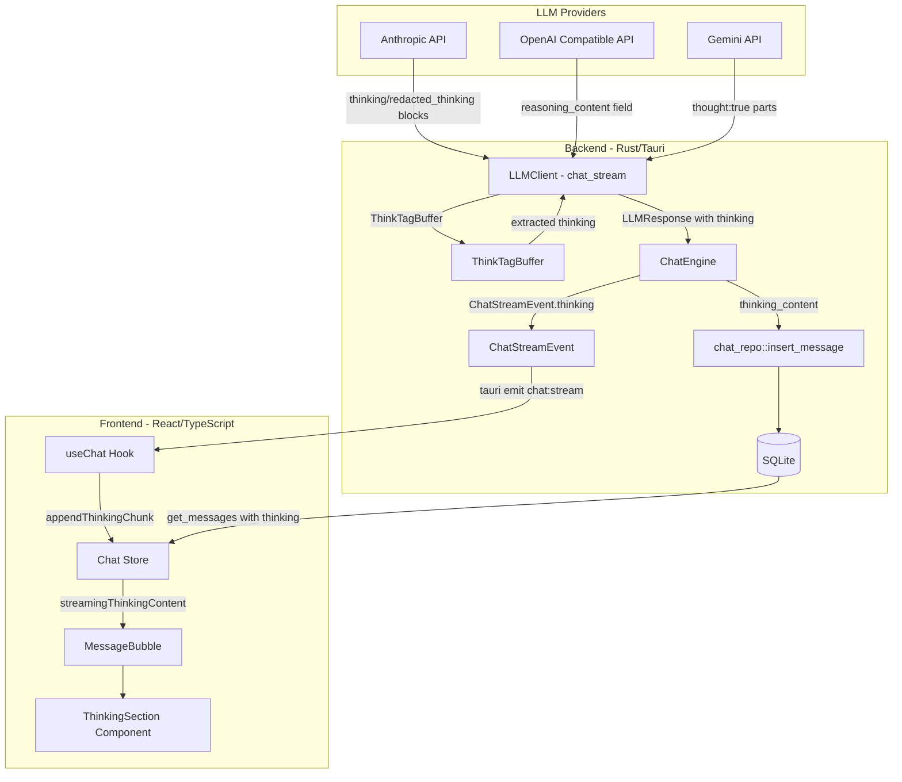
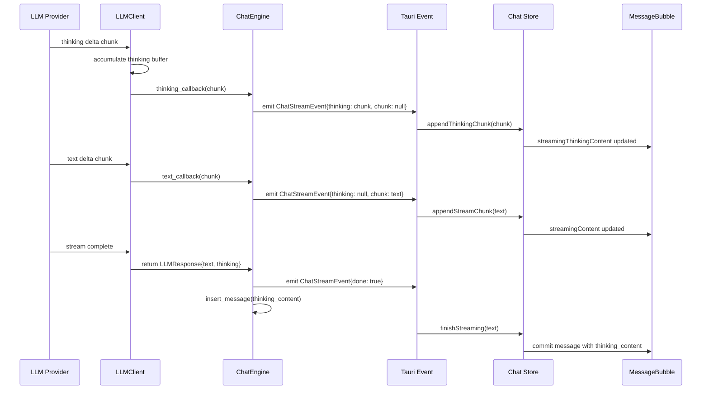

# Design Document: Thinking/Reasoning Content Support

## Overview

LLMプロバイダーが返すthinking/reasoning content（モデルの思考過程）を受信・保持・表示する機能。現在は全プロバイダーでthinking contentが破棄されているが、この機能により：

1. **LLM Client層**: 各プロバイダーのthinking contentを個別に検出・蓄積し、`LLMResponse`の独立フィールドとして返却
2. **Chat Engine層**: thinking contentを`ChatStreamEvent`の独立フィールドとしてフロントエンドに伝達
3. **永続化層**: DBスキーマに`thinking_content`カラムを追加し、メッセージと共に保存
4. **フロントエンド層**: 折り畳み可能なUIセクションでthinking contentを表示

設計方針:
- 既存の`ChatStreamEvent`構造体にフィールド追加（後方互換: thinkingがnullなら既存動作と同一）
- `LLMResponse`列挙型にthinkingフィールドを横断的に追加
- DBスキーマは`ALTER TABLE`でカラム追加（既存データは`NULL`）
- フロントエンドは既存の`MessageBubble`コンポーネントを拡張

## Architecture



### ストリーミングデータフロー



## Components and Interfaces

### 1. LLMResponse の拡張

```rust
/// LLMレスポンス — テキストまたはtool_call（thinking content付き）
#[derive(Debug, Clone, Serialize, Deserialize)]
pub enum LLMResponse {
    Text {
        content: String,
        thinking: Option<String>,
    },
    ToolCalls {
        calls: Vec<ToolCall>,
        thinking: Option<String>,
    },
}
```

**変更理由**: `LLMResponse::Text(String)` → `LLMResponse::Text { content, thinking }` に変更。thinkingは全バリアントに横断的に存在するため、各バリアントに含める設計。trait objectでのアクセス容易性と、Tool Calls実行前にもthinkingが蓄積される可能性を考慮。

### 2. LLMClient trait の拡張

```rust
/// ストリーミングコールバック型
/// text_callback: 通常テキストチャンク
/// thinking_callback: thinking/reasoning チャンク
pub type StreamCallbacks = (
    Box<dyn Fn(String) + Send>,      // text_callback
    Box<dyn Fn(String) + Send>,      // thinking_callback
);

#[async_trait]
pub trait LLMClient: Send + Sync {
    async fn chat_stream(
        &self,
        messages: &[ChatMessage],
        config: &LLMClientConfig,
        tools: Option<&[ToolDefinition]>,
        callbacks: StreamCallbacks,
    ) -> Result<LLMResponse, AppError>;
    // ... 他メソッドは変更なし
}
```

**変更理由**: 単一の`callback: Box<dyn Fn(String) + Send>`をタプル型に変更。thinking contentとtext contentを別々のコールバックで通知することで、Chat Engine側でイベントのフィールド割り当てが明確になる。

### 3. ThinkTagBuffer（新規）

`<think>`タグのチャンク境界をまたぐ検出に対応するバッファ：

```rust
/// <think>タグ抽出バッファ
/// ストリーミングチャンクが境界をまたいでタグを分割する場合に対応
pub struct ThinkTagBuffer {
    /// 現在<think>タグ内部にいるかどうか
    inside_think: bool,
    /// タグ検出用の未処理バッファ
    pending: String,
}

impl ThinkTagBuffer {
    pub fn new() -> Self { ... }

    /// チャンクを処理し、(text_parts, thinking_parts) を返す
    /// text_parts: 通常テキストとして出力すべき部分
    /// thinking_parts: thinking contentとして出力すべき部分
    pub fn process_chunk(&mut self, chunk: &str) -> (Vec<String>, Vec<String>);

    /// ストリーム終了時に未処理バッファを確定
    pub fn flush(&mut self) -> (Vec<String>, Vec<String>);
}
```

### 4. ChatStreamEvent の拡張

```rust
/// ストリーミングチャットイベント
#[derive(Clone, Serialize)]
pub struct ChatStreamEvent {
    pub session_id: String,
    pub chunk: String,
    pub done: bool,
    pub tool_break: bool,
    /// Thinking/reasoning content のデルタ（nullの場合はthinkingなし）
    pub thinking: Option<String>,
}
```

### 5. ChatMessageRecord の拡張

**Rust側:**
```rust
#[derive(Debug, Clone, Serialize, Deserialize)]
pub struct ChatMessageRecord {
    // ... 既存フィールド
    pub thinking_content: Option<String>,
}
```

**TypeScript側:**
```typescript
export interface ChatMessageRecord {
  // ... 既存フィールド
  thinking_content?: string | null;
}
```

### 6. Chat Store の拡張

```typescript
interface ChatState {
  // ... 既存フィールド
  streamingThinkingContent: string;
  isThinking: boolean;

  appendThinkingChunk: (chunk: string) => void;
  // 既存メソッドの変更: commitPreToolContent, finishStreaming にthinking引数追加
}
```

### 7. ThinkingSection コンポーネント（新規）

```typescript
interface ThinkingSectionProps {
  thinkingContent: string;
  isStreaming?: boolean;
  isRedacted?: boolean;
  defaultExpanded?: boolean;
}

export function ThinkingSection({
  thinkingContent,
  isStreaming = false,
  isRedacted = false,
  defaultExpanded = false,
}: ThinkingSectionProps): ReactNode;
```

## Data Models

### DB スキーマ変更

```sql
-- マイグレーション: chat_messages テーブルに thinking_content カラム追加
ALTER TABLE chat_messages ADD COLUMN thinking_content TEXT;
```

SQLiteの`ALTER TABLE ADD COLUMN`はデフォルト値がNULLになるため、既存データとの互換性を維持。

### マイグレーション戦略

現在のプロジェクトは`IF NOT EXISTS`による冪等なスキーマ作成方式を採用。新カラム追加には：

1. `migrations.rs`の`create_tables_sql()`内のCREATE TABLE文に`thinking_content TEXT`を追加
2. 新たに`run_migrations()`内で`ALTER TABLE`文を実行（既存DBへの対応）
3. `ALTER TABLE`実行時のエラー（カラム既存）は無視する

```rust
// migrations.rs に追加
pub fn migration_add_thinking_content() -> &'static str {
    "ALTER TABLE chat_messages ADD COLUMN thinking_content TEXT"
}
```

```rust
// database.rs の run_migrations() に追加
fn run_migrations(&self) -> Result<(), AppError> {
    self.conn.execute_batch(migrations::create_tables_sql())?;
    self.conn.execute_batch(migrations::create_indexes_sql())?;
    // カラム追加マイグレーション（既にカラムが存在する場合はエラーを無視）
    let _ = self.conn.execute(migrations::migration_add_thinking_content(), []);
    Ok(())
}
```

### Thinking Content の内部表現

redacted_thinkingブロックはプレースホルダーマーカーとして`[REDACTED]`文字列を使用：

```rust
const REDACTED_THINKING_MARKER: &str = "[REDACTED_THINKING]";
```

フロントエンドはこのマーカーを検出して専用UIを表示する。通常のthinkingテキストとredactedマーカーは結合して1つの文字列として保持（出現順序維持）。

### Thinking Content 文字数制限

保存時に200,000文字で切り詰め：

```rust
fn truncate_thinking_content(content: &str) -> &str {
    if content.len() > 200_000 {
        // UTF-8境界を考慮して切り詰め
        let mut end = 200_000;
        while !content.is_char_boundary(end) && end > 0 {
            end -= 1;
        }
        &content[..end]
    } else {
        content
    }
}
```

## Correctness Properties

*A property is a characteristic or behavior that should hold true across all valid executions of a system—essentially, a formal statement about what the system should do. Properties serve as the bridge between human-readable specifications and machine-verifiable correctness guarantees.*

### Property 1: Thinking content separation from text content

*For any* LLM provider stream containing both thinking and text content, the thinking content SHALL be accumulated exclusively in the thinking buffer and SHALL NOT appear in the text callback output, and vice versa.

**Validates: Requirements 1.1, 1.2, 1.3, 1.5**

### Property 2: Think tag extraction across chunk boundaries

*For any* text containing `<think>...</think>` blocks, splitting the text at arbitrary chunk boundaries and processing each chunk sequentially through the ThinkTagBuffer SHALL produce the same extracted thinking content as processing the entire text at once.

**Validates: Requirements 1.4**

### Property 3: Stream event field assignment invariant

*For any* ChatStreamEvent emitted by the Chat Engine during streaming, if thinking content is present then the thinking field contains the thinking delta and the chunk field is empty, and if text content is present then the chunk field contains the text delta and the thinking field is null.

**Validates: Requirements 2.2, 2.3, 2.5**

### Property 4: Thinking content accumulation preserves concatenation

*For any* sequence of thinking deltas received during a single streaming response, the final accumulated thinking content in the committed message SHALL equal the concatenation of all thinking deltas in their received order.

**Validates: Requirements 3.2, 3.3**

### Property 5: DB persistence round-trip for thinking content

*For any* valid ChatMessageRecord with a non-null thinking_content field, inserting the record into the database and then retrieving it SHALL produce a record with identical thinking_content value.

**Validates: Requirements 4.2, 4.3**

### Property 6: Thinking content truncation invariant

*For any* thinking content string, after truncation the saved content SHALL have length ≤ 200,000 characters AND SHALL be a prefix of the original content (preserving UTF-8 character boundaries).

**Validates: Requirements 4.5**

### Property 7: Thinking block type and order preservation

*For any* Anthropic response containing a sequence of `thinking` and `redacted_thinking` blocks, the accumulated thinking content SHALL preserve the type annotation (normal vs redacted marker) and the original ordering of all blocks.

**Validates: Requirements 6.1, 6.4**

### Property 8: Tool break preserves accumulated thinking content

*For any* tool_break event occurring during streaming, the thinking content accumulated up to that point SHALL be associated with the committed pre-tool assistant message, and the thinking buffer SHALL be reset to empty for subsequent streaming.

**Validates: Requirements 8.1, 8.2**

## Error Handling

### LLM Client層

| エラー状況 | 処理方針 |
|-----------|---------|
| thinking blockのJSON解析失敗 | thinkingをスキップし、テキストのみ処理を続行。エラーログ出力 |
| `<think>`タグが閉じずにストリーム終了 | バッファ内容をthinking contentとして確定（`flush()`で処理） |
| thinking content + text両方が空 | `LLMResponse::Text { content: "", thinking: None }` を返す |
| redacted_thinking blockの data フィールド欠落 | マーカーのみ挿入し処理続行 |

### Chat Engine層

| エラー状況 | 処理方針 |
|-----------|---------|
| thinking_contentの切り詰め中にUTF-8境界違反 | バイト位置を戻して有効な境界を探索 |
| DBへのthinking_content保存失敗 | メッセージ本文の保存は試行し、thinking_contentのみ失敗をログ出力 |
| イベント発行失敗 | 既存のエラー処理と同様（`map_err`で`AppError::Io`） |

### フロントエンド層

| エラー状況 | 処理方針 |
|-----------|---------|
| thinking fieldがnullでもstringでもない | nullとして扱い、表示セクションをレンダリングしない |
| thinking_contentが極端に長い（表示パフォーマンス） | CSS `max-height` + スクロールで対応 |
| redactedマーカー検出失敗 | 通常のthinking contentとして表示 |

## Testing Strategy

### Property-Based Testing

PBTライブラリ: **proptest** (Rust)

各propertyテストは最低100イテレーション実行。テストタグ形式: `Feature: thinking-reasoning-support, Property {number}: {property_text}`

#### 対象プロパティ

| Property | テスト対象モジュール | 戦略 |
|----------|-------------------|------|
| Property 1 | `llm/client.rs` (各プロバイダーのstream parse) | ランダムなSSEチャンク列を生成し、thinking/textの分離を検証 |
| Property 2 | `ThinkTagBuffer` | ランダムなHTML文字列を生成し、ランダムな位置で分割。一括処理と分割処理の結果を比較 |
| Property 3 | `ChatEngine` のイベント発行ロジック | thinking/textデルタをランダムに生成し、emitされるイベントのフィールドを検証 |
| Property 4 | フロントエンド `Chat Store` | ランダムなデルタ列を生成し、最終accumulated valueが連結と一致することを検証 |
| Property 5 | `db/repositories/chat.rs` | ランダムなthinking_content文字列でinsert/getの往復を検証 |
| Property 6 | truncation関数 | ランダムな長さの文字列（マルチバイト含む）で切り詰め後の長さ・prefix性を検証 |
| Property 7 | Anthropic stream parser | thinking/redacted_thinkingブロックのランダム列を生成し、順序・型保持を検証 |
| Property 8 | `Chat Store` のtool_break処理 | ランダムなthinkingデルタ後にtool_breakを発火し、確定バブルへの関連付けを検証 |

### Unit Tests (Example-Based)

| 対象 | テストケース |
|------|------------|
| `ChatStreamEvent` 構造体 | thinking=null で後方互換性を確認 (Req 2.5, 2.6) |
| `ChatMessageRecord` | thinking_content=None のデフォルト動作確認 (Req 4.4) |
| `ThinkingSection` Component | デフォルト折り畳み状態、トグル動作、redacted表示 (Req 5.1-5.6) |
| `Chat Store` | isThinking フラグの遷移 (Req 7.1-7.4) |
| DB migration | 既存テーブルへのカラム追加が冪等に実行可能 |
| `Chat Store` tool_break | thinking空時のnull保持 (Req 8.3) |

### Integration Tests

| 対象 | テストケース |
|------|------------|
| 全プロバイダーE2E | 実際のSSEストリームをモック → LLMResponse のthinkingフィールド検証 |
| DB永続化E2E | thinking付きメッセージのinsert → get_messages → フロントエンド表示 |
| ストリーミングE2E | thinking → text → done のイベントシーケンス全体の検証 |
