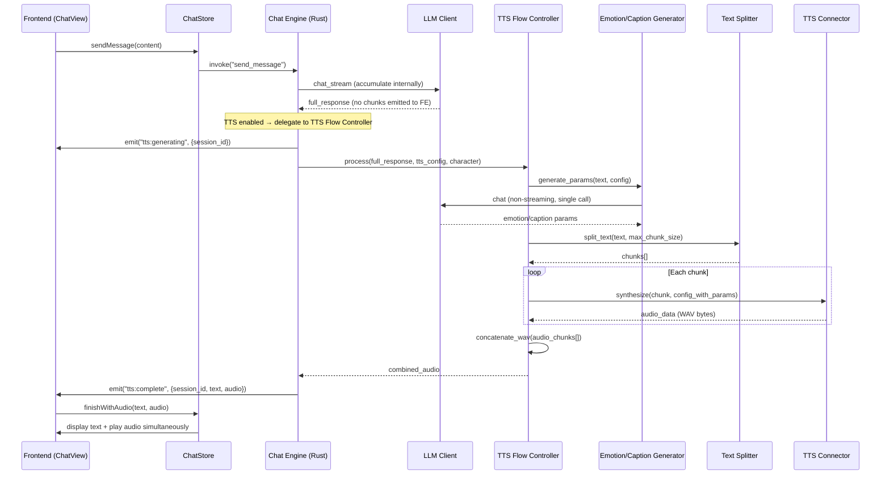
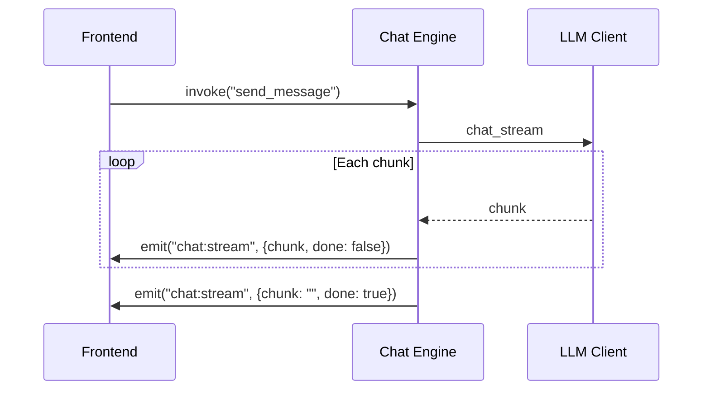

# Design Document: TTS Playback Flow

## Overview

TTS有効時のチャットフローを再設計し、LLM応答完了後にTTS音声生成→テキスト+音声同時配信を実現する。既存のストリーミング表示フローを条件分岐し、TTS有効時は応答を蓄積してから一括処理する。

主要な変更点:
1. **Chat Engine分岐**: TTS有効/無効でストリーミング動作を切り替え
2. **TTS Flow Controller**: テキスト分割→感情/キャプション生成→音声合成→結合のオーケストレーション
3. **フロントエンド状態拡張**: TTS生成中ローディング状態の追加
4. **新イベント体系**: `tts:generating`（生成開始）、`tts:complete`（テキスト+音声配信）

### 設計方針

- 既存のストリーミングフロー（TTS無効時）は一切変更しない
- TTS処理はChat Engineの`send_message`内で完結させ、フロントエンドはイベント駆動で受動的に動作
- 感情/キャプション生成のLLM呼び出しは既存の`LLMClient::chat`（非ストリーミング）を使用
- テキスト分割は純粋関数として実装し、テスト容易性を確保

## Architecture



### TTS無効時のフロー（変更なし）



## Components and Interfaces

### 1. TTS Flow Controller (`src-tauri/src/tts/flow_controller.rs`)

TTS有効時のオーケストレーション全体を担当する新モジュール。

```rust
/// TTS Flow Controller — TTS有効時の音声生成フロー制御
pub struct TTSFlowController {
    tts_connector: Arc<dyn TTSConnector>,
    llm_client: Arc<dyn LLMClient>,
    config_manager: Arc<ModelConfigManager>,
}

/// TTS処理結果
pub struct TTSResult {
    pub audio_data: Vec<u8>,  // 結合済みWAVデータ
    pub text: String,          // 元テキスト
}

impl TTSFlowController {
    /// TTS音声生成フロー全体を実行
    /// 1. 感情/キャプション生成（LLM呼び出し）
    /// 2. テキスト分割
    /// 3. 各チャンクの音声合成
    /// 4. WAV結合
    pub async fn process(
        &self,
        text: &str,
        tts_config: &TTSConfig,
        voicepeak_path: Option<&str>,
        timeout_seconds: u64,
    ) -> Result<TTSResult, AppError>;
}
```

### 2. Text Splitter (`src-tauri/src/tts/text_splitter.rs`)

日本語テキストを文境界で分割する純粋関数モジュール。

```rust
/// テキスト分割設定
pub struct SplitConfig {
    pub max_chunk_size: usize,  // デフォルト: 140文字
}

/// テキストを音声合成用チャンクに分割（純粋関数）
pub fn split_text(text: &str, config: &SplitConfig) -> Vec<String>;
```

分割ロジック:
1. 句点（`。`）、感嘆符（`！`）、疑問符（`？`）で分割
2. 単一文がmax_chunk_sizeを超える場合、読点（`、`）でフォールバック分割
3. それでも超える場合はmax_chunk_size位置で強制分割

### 3. Emotion Generator (`src-tauri/src/tts/emotion_generator.rs`)

VoicePeak用の感情パラメータをLLMで動的生成。

```rust
/// LLMで感情パラメータを生成
pub struct EmotionGenerator;

/// 生成された感情パラメータ
pub struct GeneratedEmotionParams {
    pub emotion: EmotionParams,
    pub speed: Option<f32>,
    pub pitch: Option<f32>,
}

impl EmotionGenerator {
    /// テキストから感情パラメータを生成（単一LLM呼び出し）
    pub async fn generate(
        &self,
        text: &str,
        base_config: &TTSConfig,
        llm_client: &dyn LLMClient,
        llm_config: &LLMClientConfig,
    ) -> Result<GeneratedEmotionParams, AppError>;

    /// LLMレスポンスJSONをパースしてバリデーション
    pub fn parse_and_validate(json_str: &str, base_config: &TTSConfig) -> Result<GeneratedEmotionParams, AppError>;
}
```

### 4. Caption Generator (`src-tauri/src/tts/caption_generator.rs`)

Irodori-TTS用の喋り方キャプションをLLMで動的生成。

```rust
/// LLMで喋り方キャプションを生成
pub struct CaptionGenerator;

impl CaptionGenerator {
    /// テキストから喋り方キャプションを生成（単一LLM呼び出し）
    pub async fn generate(
        &self,
        text: &str,
        base_caption: &str,
        llm_client: &dyn LLMClient,
        llm_config: &LLMClientConfig,
    ) -> Result<String, AppError>;

    /// ベースキャプション + 動的キャプションを結合
    pub fn combine_captions(base_caption: &str, dynamic_caption: &str) -> String;
}
```

### 5. WAV Concatenator (`src-tauri/src/tts/wav_concat.rs`)

複数WAVファイルのPCMデータを結合。

```rust
/// WAVヘッダー情報
pub struct WavHeader {
    pub channels: u16,
    pub sample_rate: u32,
    pub bits_per_sample: u16,
    pub data_offset: usize,
    pub data_size: usize,
}

/// WAVヘッダーをパース
pub fn parse_wav_header(data: &[u8]) -> Result<WavHeader, AppError>;

/// 複数WAVデータを結合（同一フォーマット前提）
/// 最初のチャンクのヘッダーを基準に、全チャンクのPCMデータを連結して新しいWAVを生成
pub fn concatenate_wav(chunks: &[Vec<u8>]) -> Result<Vec<u8>, AppError>;
```

### 6. Chat Engine拡張 (`src-tauri/src/chat/engine.rs`)

`send_message`にTTS分岐ロジックを追加。

```rust
// DefaultChatEngine に追加するフィールド
pub struct DefaultChatEngine {
    // ... existing fields ...
    tts_connector: Arc<dyn TTSConnector>,
    tts_flow_controller: Option<Arc<TTSFlowController>>,
}

// send_message内の分岐:
// if tts_enabled && character.tts_config.is_some() {
//     // ストリーミングを内部蓄積モードで実行（callbackでフロントに送らない）
//     // TTS Flow Controller に委譲
//     // tts:generating イベント発行
//     // tts:complete イベント発行
// } else {
//     // 既存のストリーミングフロー
// }
```

### 7. Frontend拡張

#### ChatStore 状態追加

```typescript
interface ChatState {
  // ... existing ...
  isTTSGenerating: boolean;  // TTS音声生成中フラグ
}
```

#### useAudio Hook拡張

```typescript
// 新イベント: tts:complete
interface TTSCompleteEvent {
  session_id: string;
  text: string;
  audio: string;  // Base64エンコードWAVデータ
}

// 新イベント: tts:generating
interface TTSGeneratingEvent {
  session_id: string;
}
```

#### useChat Hook拡張

```typescript
// tts:generating リスナー追加 → isTTSGenerating = true
// tts:complete リスナー追加 → テキスト表示 + 音声再生開始 + isTTSGenerating = false
```

## Data Models

### 新規イベントペイロード（Rust側）

```rust
/// TTS生成開始イベント
#[derive(Clone, Serialize)]
pub struct TTSGeneratingEvent {
    pub session_id: String,
}

/// TTS完了イベント（テキスト+音声）
#[derive(Clone, Serialize)]
pub struct TTSCompleteEvent {
    pub session_id: String,
    pub text: String,
    pub audio: String,  // Base64エンコード
}

/// TTSエラーイベント（フォールバック時）
#[derive(Clone, Serialize)]
pub struct TTSErrorEvent {
    pub session_id: String,
    pub text: String,
    pub error: String,
}
```

### TTSConfig拡張（キャラクター設定）

```rust
/// TTS設定（キャラクター個別）— 拡張
#[derive(Debug, Clone, Serialize, Deserialize)]
pub struct TTSConfig {
    pub provider: TTSProvider,
    pub base_url: Option<String>,
    pub reference_audio_path: Option<String>,
    pub caption: Option<String>,
    pub narrator: Option<String>,
    pub emotion: Option<EmotionParams>,
    pub speed: Option<f32>,
    pub pitch: Option<f32>,
    /// Irodori-TTS: caption mode vs reference audio mode
    /// true = caption mode, false = reference audio mode
    /// None = provider がVoicePeakの場合は不使用
    #[serde(default)]
    pub irodori_mode: Option<IrodoriMode>,
}

/// Irodori-TTSの動作モード
#[derive(Debug, Clone, Serialize, Deserialize, PartialEq)]
#[serde(rename_all = "snake_case")]
pub enum IrodoriMode {
    Caption,
    ReferenceAudio,
}
```

### TTSGlobalConfig拡張

```rust
/// TTS全体設定 — 拡張
#[derive(Debug, Clone, Serialize, Deserialize)]
pub struct TTSGlobalConfig {
    pub enabled: bool,
    pub voicepeak_path: Option<String>,
    /// TTS生成タイムアウト（秒）。デフォルト: 60
    #[serde(default = "default_tts_timeout")]
    pub timeout_seconds: u64,
    /// テキスト分割の最大チャンクサイズ（文字数）。デフォルト: 140
    #[serde(default = "default_max_chunk_size")]
    pub max_chunk_size: usize,
}
```

### フロントエンド型定義追加

```typescript
/** Irodori-TTSモード */
export type IrodoriMode = 'caption' | 'reference_audio';

/** TTS設定（拡張） */
export interface TTSConfig {
  // ... existing fields ...
  /** Irodori-TTS動作モード */
  irodori_mode?: IrodoriMode;
}

/** TTS完了イベントペイロード */
export interface TTSCompleteEvent {
  session_id: string;
  text: string;
  audio: string;
}

/** TTS生成中イベントペイロード */
export interface TTSGeneratingEvent {
  session_id: string;
}

/** TTSエラーイベントペイロード */
export interface TTSErrorEvent {
  session_id: string;
  text: string;
  error: string;
}
```


## Correctness Properties

*A property is a characteristic or behavior that should hold true across all valid executions of a system—essentially, a formal statement about what the system should do. Properties serve as the bridge between human-readable specifications and machine-verifiable correctness guarantees.*

### Property 1: Text splitter round-trip preservation

*For any* input text string, concatenating all chunks produced by `split_text` in order SHALL produce a string identical to the original input text (no omission, no duplication, no reordering).

**Validates: Requirements 3.4**

### Property 2: Text splitter chunk size invariant

*For any* input text string and any configured `max_chunk_size` (> 0), every chunk produced by `split_text` SHALL have a character length less than or equal to `max_chunk_size`.

**Validates: Requirements 3.5**

### Property 3: Text splitter sentence boundary preference

*For any* input text containing sentence boundary characters (「。」「！」「？」) that gets split into multiple chunks, each non-final chunk SHALL end with a sentence boundary character, UNLESS the chunk was produced by the clause-boundary or forced-split fallback (i.e., the text between two sentence boundaries exceeds `max_chunk_size`).

**Validates: Requirements 3.2**

### Property 4: Emotion parameter validation bounds

*For any* JSON string representing emotion parameters (with arbitrary numeric values), `parse_and_validate` SHALL either return an error OR produce a `GeneratedEmotionParams` where: happy, fun, angry, sad are each within 0–100, speed is within 50–200, and pitch is within -300–300.

**Validates: Requirements 4.3**

### Property 5: WAV concatenation correctness

*For any* non-empty sequence of valid WAV byte arrays (all sharing the same sample rate, channels, and bits-per-sample), `concatenate_wav` SHALL produce a valid WAV file whose PCM data section equals the ordered concatenation of the PCM data sections from each input WAV.

**Validates: Requirements 6.1, 6.2**

### Property 6: Caption combination completeness

*For any* non-empty base voice caption string and any non-empty dynamic speaking-style caption string, `combine_captions` SHALL produce a result string that contains both the base caption and the dynamic caption as substrings.

**Validates: Requirements 7.2**

## Error Handling

### TTS Flow Controller エラー戦略

| エラー種別 | 発生箇所 | 対応 |
|---|---|---|
| LLM感情生成失敗 | EmotionGenerator | キャラクターデフォルトTTS設定にフォールバック |
| LLMキャプション生成失敗 | CaptionGenerator | ベースキャプションのみ使用 |
| TTS合成失敗（任意チャンク） | TTSConnector | テキストのみフロントエンドに配信（`tts:error`イベント） |
| TTS合成タイムアウト | TTSFlowController | TTS処理キャンセル→テキストのみ配信 |
| WAV結合失敗 | wav_concat | テキストのみフロントエンドに配信 |
| テキスト分割で空チャンク | TextSplitter | 空チャンクをスキップ |

### タイムアウト実装

```rust
// tokio::time::timeout を使用
let result = tokio::time::timeout(
    Duration::from_secs(timeout_seconds),
    self.process_internal(text, config, voicepeak_path)
).await;

match result {
    Ok(Ok(tts_result)) => Ok(tts_result),
    Ok(Err(e)) => Err(e),  // TTS処理エラー
    Err(_) => Err(AppError::Tts("TTS generation timed out".to_string())),
}
```

### フロントエンドエラー表示

- `tts:error`イベント受信時: メッセージテキストは即座に表示し、トースト通知でTTSエラーを表示
- ユーザーのチャット体験を中断しない（non-blocking）

## Testing Strategy

### Property-Based Tests（proptest使用）

プロジェクトは既に`proptest`クレートを使用しているため、同じフレームワークで実装。

- **テキスト分割**: Property 1–3をproptestで実装。日本語テキスト生成にはカスタムstrategyを定義（句読点を含むランダム文字列生成）
- **感情パラメータバリデーション**: Property 4をproptestで実装。任意のJSON値を生成してバリデーション結果を検証
- **WAV結合**: Property 5をproptestで実装。有効なWAVヘッダー+ランダムPCMデータを生成
- **キャプション結合**: Property 6をproptestで実装。任意の非空文字列ペアを生成

各プロパティテストは最低100イテレーション実行。

タグフォーマット: `Feature: tts-playback-flow, Property {number}: {property_text}`

### Unit Tests（example-based）

- Chat Engine TTS分岐: TTS有効/無効でイベント発行パターンが正しいことを確認
- Emotion Generator: LLM失敗時のフォールバック動作
- Caption Generator: LLM失敗時のフォールバック動作、reference audioモード時のキャプション非使用
- Frontend Store: `tts:generating`/`tts:complete`/`tts:error`各イベントでの状態遷移

### Integration Tests

- Chat Engine → TTS Flow Controller → TTS Connector（モック）の一連フロー
- テキスト分割→音声合成→WAV結合の統合動作確認
- タイムアウト発動時のフォールバック動作

### テストファイル配置

```
src-tauri/src/tts/
├── text_splitter.rs          # テキスト分割ロジック
├── emotion_generator.rs      # 感情パラメータ生成
├── caption_generator.rs      # キャプション生成
├── wav_concat.rs             # WAV結合
├── flow_controller.rs        # オーケストレーター
├── property_tests.rs         # 既存 + 新規プロパティテスト
└── tests.rs                  # 既存 + 新規ユニットテスト
```
