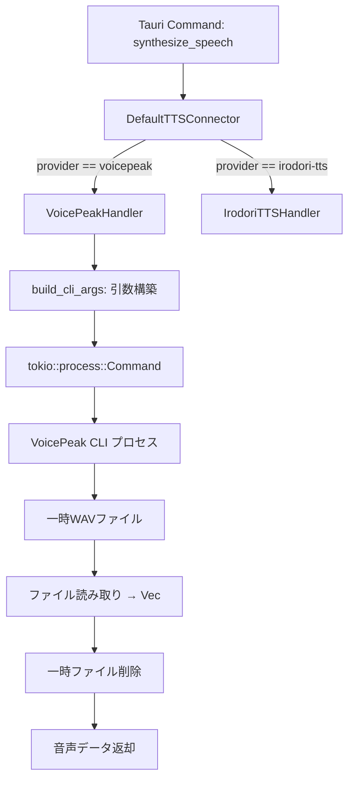
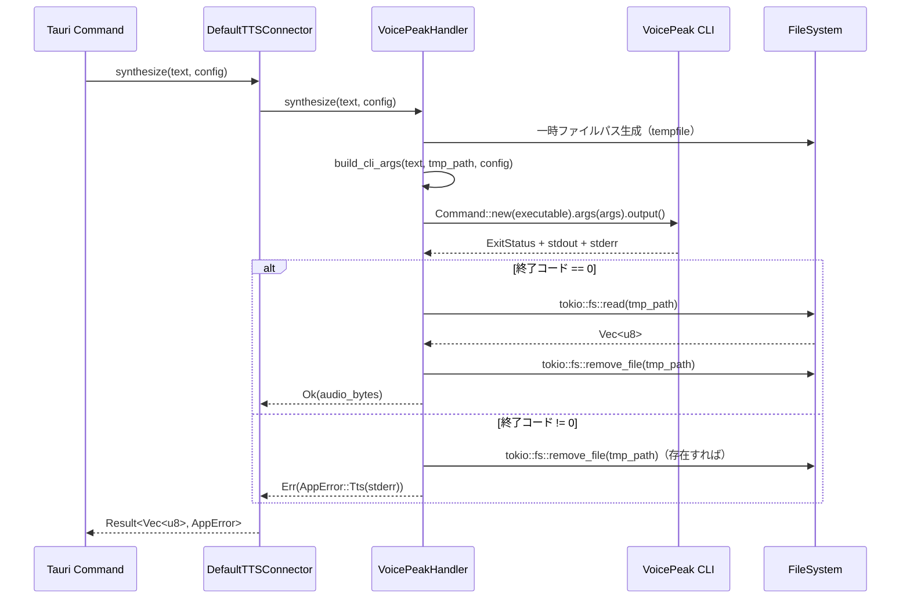
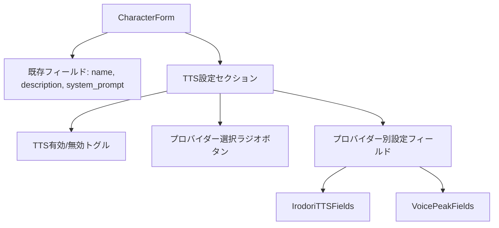

# 技術設計ドキュメント: VoicePeak CLI Integration

## 概要

VoicePeakとの連携方式を、HTTP APIブリッジサーバー経由から公式CLI直接呼び出しに変更する設計。

現在の`VoicePeakHandler`は`reqwest::Client`を使ってHTTP POSTリクエストを送信しているが、これをVoicePeak CLIプロセスの起動・引数構築・一時ファイル読み取りに置き換える。`TTSConnector`トレイトのインターフェースは維持し、`DefaultTTSConnector`内部のディスパッチロジックからHTTPクライアント依存を除去する。

### 設計方針

- **最小変更原則**: `TTSConnector`トレイトと`synthesize_speech`/`test_tts_connection`コマンドのシグネチャは変更しない
- **プロセス実行**: `tokio::process::Command`による非同期CLI実行
- **一時ファイル管理**: `tempfile`クレートで安全な一時ファイル生成、確実なクリーンアップ
- **テスタビリティ**: CLI引数構築ロジックを純粋関数として分離し、プロパティベーステストで検証可能にする

## アーキテクチャ



### 変更前後の比較

| 項目 | 変更前（HTTP方式） | 変更後（CLI方式） |
|------|-------------------|------------------|
| 依存 | reqwest::Client | tokio::process::Command |
| 通信 | HTTP POST → ブリッジサーバー | プロセス起動 → CLI実行 |
| データ取得 | HTTPレスポンスボディ | 一時WAVファイル読み取り |
| エラー検出 | HTTPステータスコード | プロセス終了コード + stderr |
| 設定 | base_url（サーバーアドレス） | executable_path（CLIパス） |

## コンポーネントとインターフェース

### VoicePeakHandler（リファクタリング後）

```rust
/// VoicePeak CLIハンドラ
pub struct VoicePeakHandler;

impl VoicePeakHandler {
    pub fn new() -> Self {
        Self
    }

    /// TTSConfigからCLI引数を構築（純粋関数）
    pub fn build_cli_args(text: &str, output_path: &Path, config: &TTSConfig) -> Vec<String>;

    /// 感情パラメータを "--emotion" フォーマット文字列に変換
    pub fn format_emotion(emotion: &EmotionParams) -> Option<String>;

    /// 音声合成: CLIプロセス実行 → WAVファイル読み取り
    pub async fn synthesize(&self, text: &str, config: &TTSConfig) -> Result<Vec<u8>, AppError>;

    /// 接続テスト: 短いテキストでCLI実行確認
    pub async fn test_connection(&self, config: &TTSConfig) -> Result<(), AppError>;
}
```

### DefaultTTSConnector（変更後）

```rust
pub struct DefaultTTSConnector {
    http_client: Client,  // Irodori-TTS用に維持
}

impl DefaultTTSConnector {
    /// VoicePeak音声合成（HTTP不要）
    async fn synthesize_voicepeak(&self, text: &str, config: &TTSConfig) -> Result<Vec<u8>, AppError> {
        let handler = VoicePeakHandler::new();
        handler.synthesize(text, config).await
    }

    /// VoicePeak接続テスト（HTTP不要）
    async fn test_voicepeak(&self, config: &TTSConfig) -> Result<(), AppError> {
        let handler = VoicePeakHandler::new();
        handler.test_connection(config).await
    }
}
```

### CLI引数構築の詳細

`build_cli_args`が生成する引数の構造:

```
voicepeak --say "テキスト" --out /tmp/output.wav [--narrator "名前"] [--emotion happy=50,sad=20] [--speed 120] [--pitch -50]
```

引数構築ルール:
1. `--say` と `--out` は常に含まれる（必須引数）
2. `--narrator` は `config.narrator` が `Some` の場合のみ
3. `--emotion` は `config.emotion` が `Some` かつ少なくとも1つのフィールドが `Some` の場合のみ
4. `--speed` は `config.speed` が `Some` の場合、整数に変換して出力
5. `--pitch` は `config.pitch` が `Some` の場合、整数に変換して出力

### 実行フロー



## データモデル

### TTSConfig（変更後）

```rust
#[derive(Debug, Clone, Serialize, Deserialize)]
pub struct TTSConfig {
    pub provider: TTSProvider,
    /// Irodori-TTS用ベースURL（VoicePeakでは不使用）
    #[serde(default)]
    pub base_url: Option<String>,
    /// VoicePeak CLI実行ファイルパス（デフォルト: "voicepeak"）
    pub executable_path: Option<String>,
    /// Irodori-TTS: 参照音声ファイルパス
    pub reference_audio_path: Option<String>,
    /// Irodori-TTS: キャプション
    pub caption: Option<String>,
    /// VoicePeak: ナレーター名
    pub narrator: Option<String>,
    /// VoicePeak: 感情パラメータ
    pub emotion: Option<EmotionParams>,
    /// 読み上げ速度（VoicePeak: 整数パーセント, e.g. 120）
    pub speed: Option<f32>,
    /// ピッチ（VoicePeak: 整数オフセット, e.g. -50）
    pub pitch: Option<f32>,
}
```

**変更点:**
- `base_url`: `String` → `Option<String>`（VoicePeakでは不要、Irodori-TTSでのみ使用）
- `executable_path`: 新規追加。VoicePeak CLIの実行ファイルパス。未指定時は`"voicepeak"`をデフォルト値として使用

### EmotionParams（変更なし）

```rust
#[derive(Debug, Clone, Serialize, Deserialize)]
pub struct EmotionParams {
    pub happy: Option<i32>,
    pub fun: Option<i32>,
    pub angry: Option<i32>,
    pub sad: Option<i32>,
}
```

### TypeScript型定義（変更後）

```typescript
export interface TTSConfig {
  provider: TTSProvider;
  /** Irodori-TTS用ベースURL */
  base_url?: string;
  /** VoicePeak CLI実行ファイルパス */
  executable_path?: string;
  reference_audio_path?: string;
  caption?: string;
  narrator?: string;
  emotion?: EmotionParams;
  speed?: number;
  pitch?: number;
}
```

## UIコンポーネント設計: キャラクターTTS設定

### 概要

`CharacterForm`コンポーネントを拡張し、TTS設定セクションを追加する。既存の名前・概要・System Promptフィールドの下に、TTS有効/無効トグル・プロバイダー選択・プロバイダー別設定フィールドを配置する。

### コンポーネント構成



### フォームステート設計

```typescript
// TTS設定セクションのローカルステート
interface TTSFormState {
  /** TTS有効/無効 */
  enabled: boolean;
  /** 選択中のプロバイダー */
  provider: TTSProvider;
  /** Irodori-TTS設定値 */
  irodori: {
    base_url: string;
    reference_audio_path: string;
    caption: string;
  };
  /** VoicePeak設定値 */
  voicepeak: {
    executable_path: string;
    narrator: string;
    emotion: EmotionParams;
    speed: string;   // 入力はテキスト、送信時にnumber変換
    pitch: string;   // 同上
  };
}
```

**設計判断**: プロバイダー切り替え時に入力値を失わないよう、両プロバイダーの設定値を独立して保持する。送信時に選択中プロバイダーの値のみを`TTSConfig`に変換する。

### 初期値ロード

```typescript
// character.tts_config が存在する場合の初期化ロジック
useEffect(() => {
  if (character?.tts_config) {
    setTtsState({
      enabled: true,
      provider: character.tts_config.provider,
      irodori: {
        base_url: character.tts_config.base_url ?? '',
        reference_audio_path: character.tts_config.reference_audio_path ?? '',
        caption: character.tts_config.caption ?? '',
      },
      voicepeak: {
        executable_path: character.tts_config.executable_path ?? '',
        narrator: character.tts_config.narrator ?? '',
        emotion: character.tts_config.emotion ?? {},
        speed: character.tts_config.speed?.toString() ?? '',
        pitch: character.tts_config.pitch?.toString() ?? '',
      },
    });
  } else {
    // デフォルト: TTS無効
    setTtsState(DEFAULT_TTS_STATE);
  }
}, [character]);
```

### UIレイアウト

```
┌─────────────────────────────────────────────┐
│ 🔊 TTS設定                                  │
├─────────────────────────────────────────────┤
│ [✓] TTSを有効にする                          │
│                                             │
│ プロバイダー:                                │
│   (○) TTSサーバー（Irodori-TTS）             │
│   (●) VoicePeak（CLI方式）                   │
│                                             │
│ ─── VoicePeak設定 ───                       │
│ 実行ファイルパス: [voicepeak          ]      │
│ ナレーター:       [Japanese Female 1  ]      │
│ 速度 (%):        [100                ]      │
│ ピッチ:          [0                  ]      │
│ 感情パラメータ:                              │
│   happy: [===●=====] 50                     │
│   fun:   [●=========] 0                     │
│   angry: [●=========] 0                     │
│   sad:   [●=========] 0                     │
└─────────────────────────────────────────────┘
```

### 非活性制御ロジック

| 条件 | 非活性対象 |
|------|-----------|
| `enabled === false` | プロバイダー選択ラジオボタン、全設定フィールド |
| `provider === 'irodori-tts'` | VoicePeak設定フィールド（非表示） |
| `provider === 'voicepeak'` | Irodori-TTS設定フィールド（非表示） |

**方針**: プロバイダー別フィールドは条件付きレンダリング（非表示）で切り替え。TTS無効時はラジオボタンを`disabled`にし、設定フィールドセクション全体を非表示にする。

### onSaveデータ変換

```typescript
const handleSubmit = (e: React.FormEvent) => {
  e.preventDefault();
  if (!name.trim()) return;

  // TTS設定の構築
  let tts_config: TTSConfig | undefined = undefined;
  if (ttsState.enabled) {
    if (ttsState.provider === 'voicepeak') {
      tts_config = {
        provider: 'voicepeak',
        executable_path: ttsState.voicepeak.executable_path || undefined,
        narrator: ttsState.voicepeak.narrator || undefined,
        emotion: hasAnyEmotion(ttsState.voicepeak.emotion)
          ? ttsState.voicepeak.emotion
          : undefined,
        speed: ttsState.voicepeak.speed ? Number(ttsState.voicepeak.speed) : undefined,
        pitch: ttsState.voicepeak.pitch ? Number(ttsState.voicepeak.pitch) : undefined,
      };
    } else {
      tts_config = {
        provider: 'irodori-tts',
        base_url: ttsState.irodori.base_url || undefined,
        reference_audio_path: ttsState.irodori.reference_audio_path || undefined,
        caption: ttsState.irodori.caption || undefined,
      };
    }
  }

  onSave({
    name: name.trim(),
    description: description.trim(),
    system_prompt: systemPrompt,
    tts_config,
  });
};
```

### onSaveシグネチャ変更

```typescript
// 変更前
onSave: (data: { name: string; description: string; system_prompt: string }) => void;

// 変更後
onSave: (data: {
  name: string;
  description: string;
  system_prompt: string;
  tts_config?: TTSConfig;
}) => void;
```

### 感情パラメータ入力

感情パラメータ（happy, fun, angry, sad）は0〜100の範囲スライダーで入力する。

```typescript
// 感情スライダーコンポーネント
interface EmotionSliderProps {
  label: string;
  value: number;
  onChange: (value: number) => void;
  disabled?: boolean;
}
```

各スライダーのデフォルト値は0。値が0のパラメータは送信時に`undefined`として扱い、CLI引数に含めない。

### ヘルパー関数

```typescript
/** EmotionParamsに1つ以上の非ゼロ値があるか判定 */
function hasAnyEmotion(emotion: EmotionParams): boolean {
  return Object.values(emotion).some((v) => v != null && v > 0);
}

/** TTSFormStateからTTSConfigへの変換（送信用） */
function buildTTSConfig(state: TTSFormState): TTSConfig | undefined {
  if (!state.enabled) return undefined;
  // ... プロバイダー別の変換ロジック
}
```

### アクセシビリティ

- トグル: `role="switch"` + `aria-checked`
- ラジオボタン: `role="radiogroup"` + 各ボタンに`role="radio"`
- 非活性フィールド: `aria-disabled="true"` + `disabled`属性
- セクション: `<fieldset>` + `<legend>`でグループ化

## 正当性プロパティ（Correctness Properties）

*プロパティとは、システムの全ての有効な実行において真であるべき特性や振る舞い — つまり、システムが何をすべきかについての形式的な記述。プロパティは人間が読める仕様と機械検証可能な正当性保証の橋渡しとなる。*

### Property 1: CLI引数構築のラウンドトリップ

*For any* 有効なTTSConfig値（narrator, emotion, speed, pitchの任意の組み合わせ）に対して、`build_cli_args`で構築された引数列をパースし直すと、元のTTSConfigと等価な設定値が復元される。

**Validates: Requirements 7.1, 2.3, 2.5, 2.6, 2.7**

### Property 2: 入力テキストの保全

*For any* 入力テキスト文字列に対して、`build_cli_args`が生成する引数列の`--say`フラグの値は、入力テキストと完全に一致する（変更・切り詰め・エスケープなし）。

**Validates: Requirements 7.2, 2.1**

### Property 3: 感情パラメータのフォーマット正確性

*For any* 少なくとも1つの非Noneフィールドを持つEmotionParamsに対して、`format_emotion`が生成する文字列は、非Noneフィールドのみをカンマ区切りの`key=value`ペアとして含み、Noneフィールドは含まない。

**Validates: Requirements 7.3, 2.4**

## エラーハンドリング

### エラーケース一覧

| エラー状況 | 検出方法 | エラー型 | メッセージ内容 |
|-----------|---------|---------|--------------|
| CLI実行ファイルが見つからない | `Command::output()` が `io::Error` (NotFound) を返す | `AppError::Tts` | "VoicePeak executable not found: {path}" |
| CLIが非ゼロ終了 | `ExitStatus::success()` が false | `AppError::Tts` | "VoicePeak CLI failed (exit code {code}): {stderr}" |
| 出力WAVファイルが存在しない | `tokio::fs::read()` が `io::Error` を返す | `AppError::Tts` | "VoicePeak output file not found: {path}" |
| WAVファイル読み取り失敗 | `tokio::fs::read()` が `io::Error` を返す | `AppError::Tts` | "Failed to read VoicePeak output: {error}" |
| CLIプロセスタイムアウト | 将来的に実装（現時点では非対応） | — | — |

### 一時ファイルクリーンアップ戦略

```rust
// 成功・失敗に関わらず一時ファイルを削除
// tempfile::NamedTempFile を使用し、スコープ終了時に自動削除
// ただし、CLIに渡すためにパスを保持する必要があるため、
// tempfile::NamedTempFile::into_temp_path() を使用
```

クリーンアップフロー:
1. `tempfile::Builder::new().suffix(".wav").tempfile()` で一時ファイル生成
2. `into_temp_path()` でパスを取得（ファイルは閉じるがパスは保持）
3. CLI実行
4. 成功時: ファイル読み取り後、`TempPath` のドロップで自動削除
5. 失敗時: `TempPath` のドロップで自動削除

`TempPath`はDrop実装で自動削除されるため、パニックやearly returnでもクリーンアップが保証される。

### エラー伝播パターン

```rust
pub async fn synthesize(&self, text: &str, config: &TTSConfig) -> Result<Vec<u8>, AppError> {
    let tmp = tempfile::Builder::new()
        .suffix(".wav")
        .tempfile()
        .map_err(|e| AppError::Tts(format!("Failed to create temp file: {}", e)))?;
    let tmp_path = tmp.into_temp_path();

    let executable = config.executable_path.as_deref().unwrap_or("voicepeak");
    let args = Self::build_cli_args(text, tmp_path.as_ref(), config);

    let output = tokio::process::Command::new(executable)
        .args(&args)
        .output()
        .await
        .map_err(|e| AppError::Tts(format!("VoicePeak executable not found: {}", e)))?;

    if !output.status.success() {
        let stderr = String::from_utf8_lossy(&output.stderr);
        return Err(AppError::Tts(format!(
            "VoicePeak CLI failed (exit code {}): {}",
            output.status.code().unwrap_or(-1),
            stderr
        )));
    }

    let audio_data = tokio::fs::read(&tmp_path)
        .await
        .map_err(|e| AppError::Tts(format!("Failed to read VoicePeak output: {}", e)))?;

    Ok(audio_data)
    // tmp_path はここでドロップ → 自動削除
}
```

## テスト戦略

### テストアプローチ

**プロパティベーステスト**（`proptest`クレート使用）:
- CLI引数構築ロジックの正当性を検証
- 最低100イテレーション/プロパティ
- 各テストは設計ドキュメントのプロパティを参照するタグ付き
- タグフォーマット: `Feature: voicepeak-cli-integration, Property {number}: {property_text}`

**ユニットテスト**:
- デフォルト値の適用（executable_path未指定時）
- 空のEmotionParams（全フィールドNone）の処理
- TTSConfigのシリアライズ/デシリアライズ互換性

**統合テスト**:
- モックスクリプト（正常終了・異常終了）を使ったプロセス実行テスト
- 一時ファイルクリーンアップの検証
- 存在しない実行ファイルパスでのエラーハンドリング

### プロパティテスト実装方針

```rust
use proptest::prelude::*;

// TTSConfig用のArbitraryジェネレータ
fn arb_emotion_params() -> impl Strategy<Value = EmotionParams> {
    (
        proptest::option::of(0i32..=100),
        proptest::option::of(0i32..=100),
        proptest::option::of(0i32..=100),
        proptest::option::of(0i32..=100),
    ).prop_map(|(happy, fun, angry, sad)| EmotionParams { happy, fun, angry, sad })
}

fn arb_tts_config_voicepeak() -> impl Strategy<Value = TTSConfig> {
    (
        proptest::option::of("[a-zA-Z ]{1,30}"),  // narrator
        proptest::option::of(arb_emotion_params()),
        proptest::option::of(50f32..=200.0),      // speed
        proptest::option::of(-100f32..=100.0),    // pitch
    ).prop_map(|(narrator, emotion, speed, pitch)| TTSConfig {
        provider: TTSProvider::Voicepeak,
        base_url: None,
        executable_path: None,
        reference_audio_path: None,
        caption: None,
        narrator,
        emotion,
        speed,
        pitch,
    })
}
```

### テストファイル構成

- `src-tauri/src/tts/property_tests.rs` — プロパティベーステスト（3プロパティ）
- `src-tauri/src/tts/tests.rs` — ユニットテスト（デフォルト値、エッジケース）
- 統合テストは`src-tauri/tests/`配下に配置（VoicePeak CLIが利用可能な環境でのみ実行）

